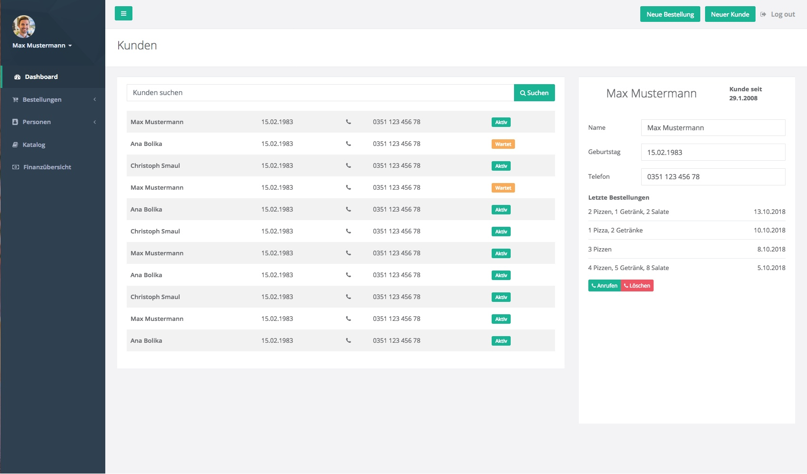
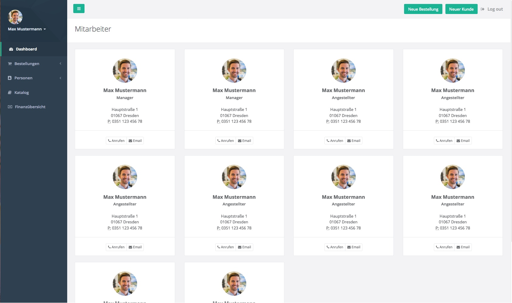
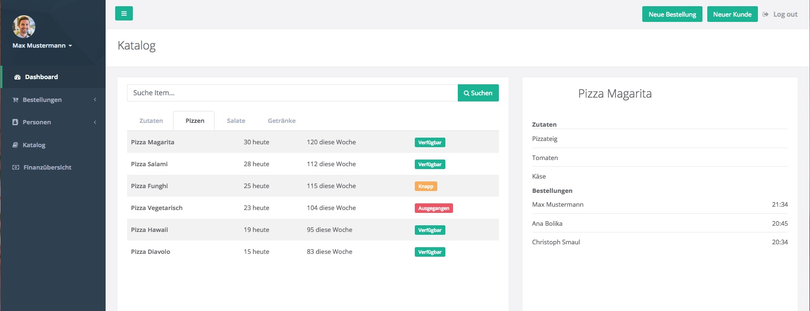
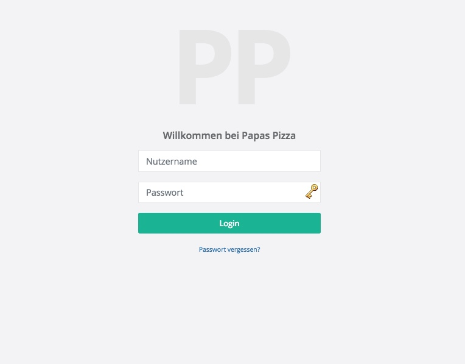

:project_name: Papas Pizza
= Pflichtenheft __{project_name}__
:doctype: book
:numbered:
:source-highlighter: highlightjs
:toc:

== Parteien

Papas Pizza +
vertreten durch Herrn Landfried +
 -- nachfolgend Kunde genannt --

Gruppe 15, bestehend aus:

* Artém Bykov
* Christian Gärber
* Julian Willingmann
* Vincent Adam
* Nick Lehmann

-- nachfolgend Entwicklerteam oder Gruppe genannt --

== Zusammenfassung

Dieses Pflichtenheft repräsentiert die Anforderungen an das Managementsystem von Papas Pizza, welches unsere Gruppe im
Rahmen des Softwarepraktikums erstellen soll. Dieses Dokument dient als Verschriftlichung der Kommunikation zwischen uns
als Entwicklerteam und dem Kunden und somit auch als potenitelle Grundlage für einen Vertrag. Hier wird festgelegt,
welche Aufgaben das Entwicklerteam zu implementieren hat und teilweise auch, in welcher Form dies getan wird.

Das Pflichtenheft dient auch der Aufgabe, nach Abschluss der Implementierung zu entscheiden, ob die Aufgabe hinreichend
erfüllt wurde. Deswegen werden alle Ziele in einer Form formuliert, das am Ende des Projektes eindeutig bestimmt werden kann,
ob ein Aspekt erfüllt wurde oder nicht. Bereits der erste Entwurf ist als komplett anzusehen und während des Entwurfs sollen
lediglich Kleinigkeiten hinzugefügt oder verändert werden. Dies muss allerdings immer in Rücksprache mit dem Kunden
geschehen.

== Aufgabenstellung und Zielsetzung

Der Pizza-Service Papa Pizza ist ein Pizza-Unternehmen, welches für seine lokale Filiale ein Managementsystem entwickeln
lassen möchte. In diesem Abschnitt wird beschrieben, welche anfänglichen Anforderungen der Kunde an das System stellt.

Als Hauptbestandteil des System ist die Verwaltung von Bestellungen anzusehen. Aufgrund von schlechten Erfahrungen mit
Telefonscherzen möchte der Kunde, dass die Annahme und Verarbeitung von Bestellungen wie folgt ablaufen soll:

* Neue Kunden tätigen ihre erste Bestellung persönlich in der Papa Pizza-Filiale. Dabei werden die Kundendaten nebst
Telefonnummer aufgenommen. Mit der Rechnung erhält der Kunde seine erste TAN (Transaktionsnummer).
* Im Regelfall bestellen Kunden telefonisch und weisen sich dabei mit ihrer Telefonnummer und TAN aus. Damit ist die TAN
für den Kunden verbraucht.
* Bei Auslieferung erhalten Kunden mit der Rechnung eine neue TAN.
* Wer seine Pizza persönlich abholt, erhält einen Rabatt von 10%.

Ein weiterer, wichtiger Bestandteil der Bestellungsverwaltung ist das individuelle Zusammenstellen von Pizzen. Daher
sollen Kunden in der Lage sein, vorkonfigurierte Pizzen zu bestellen, diese nach Wunsch zu erweitern oder gänzlich
individuell ihre eigene Pizza zusammenzustellen. Zusätzlich zu den Pizzen sollen Kunden ebenfalls Salate und Getränke
bestellen können. Bei der Erstellung soll das System zusätlich darauf achten, dass ein Kunde ab einem Bestellwert von
30€ ein Gratisgetränk erhält.

Um die Arbeit in der Filiale zu unterstützen, soll das System ebenfalls eine einfache Lagerverwaltung
ermöglichen. Dazu gehört eine Übersicht über Zutaten und Getränke, sowie das Vorkonfigurieren von Pizzen und Salaten.
Für alle Inhalte im Lager soll es möglich sein, diese neu anzulegen, zu verändern oder zu löschen.

Damit der Kunde bereits vor dem Anruf in der Filiale eine Übersicht über das reichhaltige Angebot bekommen kann, soll
das System auch über eine Website verfügen, die die aktuellen Daten der Lagerverwaltung in einer leicht verständlichen
Form dem Kunden präsentiert.

Weiterhin soll das System die Öfen in der Filiale verwalten. Pizzen werden in den verfügbaren Öfen im 5-Minuten-Takt
gebacken, d.h. alle 5 Minuten kann eine weitere Pizza in einen der Öfen geschoben werden. Das System soll eine bestellte
Pizza zum nächsten Zeitpunkt für einen Ofen einplanen und somit auch vorhersagen, wann die Pizza geliefert werden kann.
Da die Anzahl der benötigten Öfen und Pizzabäcker vom Kundenandrang abhängt, soll das System eine bequeme Übersicht über
die aktuelle und vergangene Auslastung der Öfen anzeigen können, damit die Anzahl der Öfen vierteljährlich an die
aktuellen Bestellungszahlen angepasst werden kann.

Inwieweit die Fahrer in das System mit eingebunden werden sollen, wird in diesem Dokument noch nicht genau beschrieben,
sondern im Verlauf des Entwurfes mit dem Kunden weiter geklärt.

Desweitern soll das System eine Komponente für die Buchhaltung enthalten. Dazu gehört die Übersicht über vergangene
Bestellungen und den Gewinn der Filiale. Auch die Verwaltung von Essgarnituren, die ein Kunde auf Wunsch zu seinem Essen
gegen eine Kaution von 15€ bestellen kann, soll von dieser Komponente übernommen werden. Wird eine Garnitur nämlich
nicht innerhalb von vier Wochen wieder abgegeben, wird sie als verkauft angesehen.

Weitere Aufgaben des Systems sind auch die Verwaltung des Personals und des Kundenstammes, wozu auch die Generierung
von TANs für die Bestellungen zählt.

Das System soll in Form einer Website entwickelt werden, auf der sich die Angestellten mit ihrem Nutzernamen und Kennwort
anmelden können sollen, um Zugriff auf alle Funktionen zu bekommen.

== Produktnutzung

Das System soll ausschließlich an den Rechnern in der Filiale genutzt werden. Somit sind die einzigen Nutzer, die vollen
Zugriff auf das System haben, die Angestellten von Papas Pizza. Es kann daher davon ausgegangen werden, dass alle diese
Nutzer nicht fachfremd sind und es für sie keiner weiteren Erklärung der internen Arbeitsprozesse bedarf. Jedoch soll
es für diese Gruppe von Nutzern möglich sein, dass System vollständig ohne weitreichende technische Kenntnisse bedienen
zu können. Deshalb soll die Bedienoberfläche aufgeräumt und benutzerfreundlich erstellt werden.

Bei den Angestellten soll desweiteren zwischen normalen Angestellten und Managern unterschieden werden. Während der normale
Angestellte lediglich Zugriff auf die Bestellungs- und Kundenverwaltung haben soll sowie rudimentären Zugriff auf die
Lagerverwaltung, hat der Manager alle Befugnisse (Ofen-, Personal und Lagerverwaltung). Es ist besonders darauf zu achten,
dass sich die Benutzeroberfläche daran anpasst, welche Rolle der angemeldete Angestellte hat. Das heißt, während es dem
normalen Angestellten unkompliziert möglich sein soll, neue Bestellungen und Kunden anzulegen, ist der einfache Zugriff
auf den Lagerverwaltung und auf die finanziellen Übersichten das wichtigste für den Manager.

Weitere Nutzer des Systems sind die Kunden von Papas Pizza, die sich über eine Website über das aktuelle Angebot von
Papas Pizza informieren können müssen.

== Interessensgruppen
Der folgende Abschnitt beschreibt eine Liste aller Personengruppen, die einen Einfluss auf die Anforderungen an das
System haben. Zusätzlich dazu wird jeder Gruppe von Personen eine Priorität zugeordnet, um im Fall eines
Interessenkonfliktes schneller entscheiden zu können, welchem Anliegen Vorrang gegeben werdenSoll

[options="header", cols="2, ^1, 4, 4"]
|===
|Name
|Priorität (zwischen 1 und 5)
|Beschreibung
|Interessen und Ziele

|Manager der Papas Pizza Filiale
|5
|Der Hauptkunde des Projektes
a|
- Steigerung des Gewinnes
- Optimmierung der Arbeitszeit
- Zugang zu einfachen finanziellen Übersichten
- Vereinfachung der Lagerverwaltung

|normale Angestellte in der Filiale
|4
|Hauptnutzer der Software
a|
- Einfache Abbildung und Automatisierung der Arbeitsprozesse
- Einfaches Erstellen von Bestellungen
- Automatische Verwaltung der TANs

|Kunden der Filiale
|3
|Kunden, die bei der Filiale bestellen
a|
- Übersicht über das Angebot der Filiale

|Developers
|2
|Softwareentwickler, die das System später warten müssen
a|
- Klare Benennung der Komponenten
- ausführliche Dokumentation
- umfangreiche Tests, um spätere Updates zu vereinfachen

|===

== Systemgrenze und Top-Level-Architektur

=== Kontextdiagramm
Das Kontextdiagramm zeigt das geplante Software-System in seiner Umgebung. Zur Umgebung gehören alle Nutzergruppen des
Systems und Nachbarsysteme.

image::..\models\analysis\images\Kontextdiagramm.png[Kontextdiagramm, 100%, 100%, pdfwidth=100%, title= "Kontextdiagramm von {project_name}", align=center]

=== Top-Level-Architektur
image::..\models\analysis\images\TLA2.png[TLA, 100%, 100%, pdfwidth=100%, title= "Top Level Architektur von {project_name}", align=center]

== Anwendungsfälle

Dieser Abschnitt soll einen Überblick über die unterschiedlichen Anwendungsfälle bieten, mit welchen die zu erstellende
Software umgehen können muss.

=== Akteure

Akteure sind die Benutzer des Software-Systems oder Nachbarsysteme, welche darauf zugreifen. Die folgende Tabelle
dokumentiert alle Akteure und beschreibt diese kurz.

[options="header"]
[cols="1,1,4"]
|===
|Name |Rolle| Beschreibung
|Nutzer [[A01]]  |entfällt |Repräsentiert jegliche Person, welche mit dem System interagiert.
|Kunde [[A02]]   |entfällt |Personen, welche keinen Zugriff auf den Internen Bereich haben und lediglich den Webauftritt
(mit Katalog) einsehen können
|Mitarbeiter [[A03]] |Manager |Person mit administrativen Rechten im System. Hat Zugriff auf die komplette Logistik und
Datenbanken.
|Mitarbeiter [[A04]] |Normal |Anderweitig angestellte Person, kann keine Änderungen an den Bestands- und
Mitarbeiterdatenbanken vornehmen.
|===

=== Überblick Anwendungsfalldiagramm

image::..\models\analysis\images\Anwendungsfalldiagramm.png[Anwendungsfalldiagramm, 100%, 100%, pdfwidth=100%, title= "Anwendungsfalldiagramm von {project_name}", align=center]

=== Anwendungsfallbeschreibungen
Dieser Abschnitt beschreibt die bereits genannten Anwendungsfälle genauer. Die einzelnen Anwendungsfälle sind jeweils
mit einem zusätzlichen Sequenzdiagramm versehen.

[[UC0101]]
[cols="1,4"]
|===
|Name, ID | Element löschen _(Katalog)_, <<UC0101>>
|Beschreibung | Einem Manager soll es möglich sein einzelne Elemente aus dem Katalog und der dazugehörigen Datenbank zu
zu löschen. Dies sollte bei Auslösung zusätzlich bestätigt werden müssen.
|Akteure | Mitarbeiter _(Manager)_, <<A03>>
|Auslöser | Eingeloggter Mitarbeiter _(Manager)_ klickt auf Löschen-Schaltfläche in der Auflistung des
Katalogs (Manager-Ansicht).
|Voraussetzungen | Mitarbeiter hat Manager-Rechte, ist eingeloggt, ist in Katalog-Ansicht
|Schritte a|
1. Klicken auf Schaltfläche "Katalog anzeigen"
2. Klicken auf Löschen-Icon neben einem Katalog-Eintrag
3. Bestätigen in zusätzlichem Pop-Up, dass die Aktion erfolgen soll
|Funktionale Anforderungen | <<F0401>>, <<F0301>>, <<F0302>>, <<F0504>>, <<F0102>>
|Sequenzdiagramm | <<SD0101>>
|===

[[SD0101]]
image::..\models\analysis\images\KatalogItemLöschen.png[SD0101, 100%, 100%, pdfwidth=100%, title= "Element löschen", align=center]

___

[[UC0102]]
[cols="1,4"]
|===
|Name, ID | Element hinzufügen _(Katalog)_, <<UC0102>>
|Beschreibung | Einem Manager soll es möglich sein dem vorhandenen Sortiment Neues hinzuzufügen.
|Akteure | Mitarbeiter _(Manager)_, <<A03>>
|Auslöser | Eingeloggter Mitarbeiter _(Manager)_ klickt auf "Neues Element hinzufügen" in der Auflistung des Katalogs
(Manager-Ansicht).
|Voraussetzungen | Mitarbeiter hat Manager-Rechte, ist eingeloggt, ist in Katalog-Ansicht
|Schritte a|
1. Klicken auf Schaltfläche "Katalog anzeigen"
2. Klicken auf "Neues Element hinzufügen"
3. Informationen eingeben
4. Klicken auf Schaltfläche "Bestätigen"
|Funktionale Anforderungen | <<F0401>>, <<F0301>>, <<F0302>>, <<F0504>>, <<F0104>>, <<F0102>>
|Sequenzdiagramm | <<SD0102>>
|===

[[SD0102]]
image::..\models\analysis\images\KatalogItemHinzufügen.png[SD0102, 100%, 100%, pdfwidth=100%, title= "Element hinzufügen", align=center]

___

[[UC0103]]
[cols="1,4"]
|===
|Name, ID | Element bearbeiten _(Katalog)_, <<UC0103>>
|Beschreibung | Einem Manager soll es möglich sein, vorhandene Einträge im Katalog zu editieren, um deren Details
anzupassen.
|Akteure | Mitarbeiter _(Manager)_, <<A03>>
|Auslöser | Eingeloggter Mitarbeiter _(Manager)_ klickt auf Editieren-Schaltfläche in der Auflistung des
Katalogs (Manager-Ansicht).
|Voraussetzungen | Mitarbeiter hat Manager-Rechte, ist eingloggt, ist in Katalog-Ansicht
|Schritte a|
1. Klicken auf Schaltfläche "Katalog anzeigen"
2. Klicken auf Editieren-Icon neben einem Katalog-Eintrag
3. Neue Informationen eingeben
4. Klicken auf Schaltfläche "Bestätigen"
|Funktionale Anforderungen | <<F0402>>, <<F0301>>, <<F0302>>, <<F0504>>, <<F0104>>, <<F0102>>
|Sequenzdiagramm | <<SD0103>>
|===

[[SD0103]]
image::..\models\analysis\images\KatalogItemBearbeiten.png[SD0103, 100%, 100%, pdfwidth=100%, title= "Element bearbeiten", align=center]

___

[[UC0104]]
[cols="1,4"]
|===
|Name, ID | Lagerware bearbeiten, <<UC0104>>
|Beschreibung | Dem Manager soll es möglich sein die Lagerbestände anzupassen.
|Akteure | Mitarbeiter _(Manager)_, <<A03>>
|Auslöser | Eingeloggter Mitarbeiter _(Manager)_ klickt auf "Lagerware editieren"-Schaltfläche in der Auflistung des
Katalogs (Manager-Ansicht).
|Voraussetzungen | Mitarbeiter hat Manager-Rechte, ist eingloggt, ist in Katalog-Ansicht
|Schritte a|
1. Klicken auf Schaltfläche "Katalog anzeigen"
2. Klicken auf "Lagerware bearbeiten"
3. Neue Informationen in die Auflistung eintragen
|Funktionale Anforderungen | <<F0401>>, <<F0301>>, <<F0302>>, <<F0504>>, <<F0104>>, <<F0102>>
|Sequenzdiagramm | <<SD0104>>
|===

[[SD0104]]
image::..\models\analysis\images\LagerwareBearbeiten.png[SD0104, 100%, 100%, pdfwidth=100%, title= "Lagerware bearbeiten", align=center]

___

[[UC0105]]
[cols="1,4"]
|===
|Name, ID | Katalog anzeigen, <<UC0105>>
|Beschreibung | Dem Besucher der Webseite soll es möglich sein sich den Katalog anzeigen zu lassen.
|Akteure a|
* Mitarbeiter _(Manager)_, <<A03>>
* Mitarbeiter _(Normal)_, <<A04>>
* Kunde, <<A02>>
|Auslöser | Klicken auf die "Katalog"-Schaltfläche auf der Webseite
|Voraussetzungen | Nutzer ist auf der Webseite
|Schritte | Auf Schaltfläche "Katalog" klicken
|Funktionale Anforderungen | <<F0104>>, <<F0301>>
|Sequenzdiagramm | <<SD0105>>
|===

[[SD0105]]
image::..\models\analysis\images\KatalogAnzeigen.png[SD0105, 100%, 100%, pdfwidth=100%, title= "Katalog Anzeigen", align=center]

___

[[UC0106]]
[cols="1,4"]
|===
|Name, ID | Garnitur zurückgeben, <<UC0106>>
|Beschreibung | Einem Mitarbeiter muss es möglich sein die ausgeliehene Essgarnitur entgegen zu nehmen und dies wieder
im System zu vermerken.
|Akteure a|
* Mitarbeiter _(Manager)_, <<A03>>
* Mitarbeiter _(Normal)_, <<A04>>
|Auslöser | Klicken auf "Garnitur zurückgeben" in der Übersicht
|Voraussetzungen | Eingeloggter Mitarbeiter klickt in der Übersicht auf den Button
|Schritte a|
1. Übersichtsseite öffnen
2. Auf "Garnitur zurückgeben" klicken, Kundendaten eingeben
|Funktionale Anforderungen | <<F0107>>, <<F0701>>, <<F0702>>, <<F0102>>, <<F0301>>
|Sequenzdiagramm | <<SD0106>>
|===

[[SD0106]]
image::..\models\analysis\images\GarniturZurückgeben.png[SD0106, 100%, 100%, pdfwidth=100%, title= "Garnitur zurückgeben", align=center]

___

[[UC0107]]
[cols="1,4"]
|===
|Name, ID | Vorlage erstellen, <<UC0107>>
|Beschreibung | Dem Manager soll es möglich sein ein Vorlage, basierend auf Zutaten für einen Salat oder eine Pizza,
zu erstellen.
|Akteure |Mitarbeiter _(Manager)_, <<A03>>
|Auslöser | Klicken auf "Vorlage erstellen" in der Vorlagen-Übersicht.
|Voraussetzungen | Eingeloggter Mitarbeiter _(Manager)_ klickt in der Übersicht auf den Button.
|Schritte a|
1. Übersichtsseite öffnen
2. Vorlagen-Übersicht öffnen
3. Auf "Vorlage erstellen" klicken
|Funktionale Anforderungen | <<F0102>>, <<F0504>>, <<F0901>>, <<F0302>>, <<F0301>>
|Sequenzdiagramm | <<SD0107>>
|===

[[SD0107]]
image::..\models\analysis\images\VorlageHinzufügen.png[SD0107, 100%, 100%, pdfwidth=100%, title= "Vorlage Hinzufügen", align=center]

___

[[UC0108]]
[cols="1,4"]
|===
|Name, ID | Vorlage löschen, <<UC0108>>
|Beschreibung | Dem Manager soll es möglich sein eine vorhandene Vorlage zu löschen.
|Akteure |Mitarbeiter _(Manager)_, <<A03>>
|Auslöser | Klicken auf Löschen-Icon neben einer Vorlage in der Vorlagen-Übersicht.
|Voraussetzungen | Eingeloggter Mitarbeiter _(Manager)_ klickt in der Übersicht auf den Button.
|Schritte a|
1. Übersichtsseite öffnen
2. Vorlagen-Übersicht öffnen
3. Auf Icon klicken
4. Aktion bestätigen
|Funktionale Anforderungen | <<F0102>>, <<F0504>>, <<F0401>>, <<F0302>>, <<F0301>>
|Sequenzdiagramm | <<SD0108>>
|===

[[SD0108]]
image::..\models\analysis\images\VorlageLöschen.png[SD0108, 100%, 100%, pdfwidth=100%, title= "Vorlage Löschen", align=center]
___

[[UC0109]]
[cols="1,4"]
|===
|Name, ID | Vorlage bearbeiten, <<UC0109>>
|Beschreibung | Dem Manager soll es möglich sein eine vorhandene Vorlage zu bearbeiten.
|Akteure |Mitarbeiter _(Manager)_, <<A03>>
|Auslöser | Klicken auf Bearbeiten-Icon neben einer Vorlage in der Vorlagen-Übersicht.
|Voraussetzungen | Eingeloggter Mitarbeiter _(Manager)_ klickt in der Übersicht auf den Button.
|Schritte a|
1. Übersichtsseite öffnen
2. Vorlagen-Übersicht öffnen
3. Auf Icon klicken
4. Neue Daten eingeben
5. Bestätigen
|Funktionale Anforderungen | <<F0102>>, <<F0504>>, <<F0902>>, <<F0302>>, <<F0301>>
|Sequenzdiagramm | <<SD0109>>
|===

[[SD0109]]
image::..\models\analysis\images\VorlageBearbeiten.png[SD0109, 100%, 100%, pdfwidth=100%, title= "Vorlage Bearbeiten", align=center]

___

[[UC0201]]
[cols="1,4"]
|===
|Name, ID | Nutzer hinzufügen, <<UC0201>>
|Beschreibung | Einem Mitarbeiter muss es möglich sein Nutzer zum System hinzuzufügen. Falls es sich um einen Manager
handelt muss dieser auch Mitarbeiter anlegen können.
|Akteure a|
* Mitarbeiter _(Manager)_, <<A03>>
* Mitarbeiter _(Normal)_, <<A04>>
|Auslöser | Eingeloggter Mitarbeiter klickt auf Schaltfläche "Nutzer hinzufügen".
|Voraussetzungen | Mitarbeiter ist eingeloggt
|Schritte a|
_Manager_:

1. Öffne "Nutzer" Tab
2. Wähle "Nutzer anlegen" oder "Mitarbeiter anlegen"
3. Daten eingeben
4. Daten prüfen, bestätigen

_Normal_:

Selbes Verfahren, ohne "Mitarbeiter anlegen"
|Funktionale Anforderungen | <<F0302>>, <<F0301>>, <<F0504>>, <<F0101>>, <<F0102>>, <<F0501>>
|Sequenzdiagramm | <<SD0201a>>, <<SD0201b>>
|===

[[SD0201a]]
image::..\models\analysis\images\KundenHinzufügen.png[SD0201a, 100%, 100%, pdfwidth=100%, title= "Kunde hinzufügen", align=center]

[[SD0201b]]
image::..\models\analysis\images\MitarbeiterHinzufügen.png[SD0201b, 100%, 100%, pdfwidth=100%, title= "Mitarbeiter hinzufügen", align=center]

___

[[UC0202]]
[cols="1,4"]
|===
|Name, ID | Nutzer löschen, <<UC0202>>
|Beschreibung | Dem Manager soll es möglich sein Nutzer aus dem System zu löschen.
|Akteure | Mitarbeiter _(Manager)_, <<A03>>
|Auslöser | Auf das Löschen-Icon neben einem Nutzer klicken
|Voraussetzungen | Eingeloggter Mitarbeiter _(Manager)_ klickt auf Löschen-Icon.
|Schritte a|
1. Nutzerübersicht öffnen
2. Neben betreffendem Nutzer Icon klicken
3. Aktion bestätigen
|Funktionale Anforderungen | <<F0302>>, <<F0301>>, <<F0504>>, <<F0101>>, <<F0102>>, <<F0502>>
|Sequenzdiagramm | <<SD0202a>>, <<SD0202b>>
|===

[[SD0202a]]
image::..\models\analysis\images\KundenLöschen.png[SD0202a, 100%, 100%, pdfwidth=100%, title= "Kunde löschen", align=center]

[[SD0202b]]
image::..\models\analysis\images\MitarbeiterLöschen.png[SD0202b, 100%, 100%, pdfwidth=100%, title= "Mitarbeiter löschen", align=center]

___

[[UC0203]]
[cols="1,4"]
|===
|Name, ID | Nutzer bearbeiten, <<UC0203>>
|Beschreibung | Den Mitarbeitern soll es möglich sein Kunden zu editieren und deren gespeicherte Informationen
anzupassen. Der Manager soll zusätzlich die Möglichkeit haben auch Mitarbeiter zu editieren.
|Akteure a|
* Mitarbeiter _(Manager)_, <<A03>>
* Mitarbeiter _(Normal)_, <<A04>>
|Auslöser | Auf das "Editieren"-Icon neben einem Nutzer klicken
|Voraussetzungen | Eingeloggter Mitarbeiter klickt auf Editieren-Icon.
|Schritte a|
1. Nutzerübersicht öffnen
2. Neben betreffendem Nutzer Editieren-Icon klicken
3. Neue Daten eingeben
4. Aktion bestätigen
|Funktionale Anforderungen | <<F0302>>, <<F0301>>, <<F0504>>, <<F0101>>, <<F0102>>, <<F0503>>
|Sequenzdiagramm | <<SD0203a>>, <<SD0203b>>
|===

[[SD0203a]]
image::..\models\analysis\images\KundenBearbeiten.png[SD0203a, 100%, 100%, pdfwidth=100%, title= "Kunden bearbeiten", align=center]

[[SD0203b]]
image::..\models\analysis\images\MitarbeiterBearbeiten.png[SD0203b, 100%, 100%, pdfwidth=100%, title= "Mitarbeiter bearbeiten", align=center]

___

[[UC0204]]
[cols="1,4"]
|===
|Name, ID | TAN anzeigen, <<UC0204>>
|Beschreibung | Den Mitarbeitern soll es möglich sein, die derzeitige unverbrauchte TAN eines Kunden einzusehen.
|Akteure a|
* Mitarbeiter _(Manager)_, <<A03>>
* Mitarbeiter _(Normal)_, <<A04>>
|Auslöser | Auf das TAN-Icon neben einem Nutzer klicken
|Voraussetzungen | Eingeloggter Mitarbeiter klickt auf TAN-Icon.
|Schritte a|
1. Nutzerübersicht öffnen
2. Neben betreffendem Nutzer Icon klicken
|Funktionale Anforderungen | <<F0302>>, <<F0301>>, <<F0102>>, <<F0106>>, <<F0201>>
|Sequenzdiagramm | <<SD0204>>
|===

[[SD0204]]
image::..\models\analysis\images\TanAnzeigen.png[SD0204, 100%, 100%, pdfwidth=100%, title= "TAN anzeigen", align=center]

___

[[UC0205]]
[cols="1,4"]
|===
|Name, ID | Login, <<UC0205>>
|Beschreibung | Einem im System registrierten Nutzer soll es möglich sein, sich einzuloggen um sich als Mitarbeiter
dem System zu kennnzeichnen und Zugriff auf interne Funktionen erhalten zu können.
|Akteure | Nutzer, <<A01>>
|Auslöser | Nutzer will sich als Mitarbeiter identifizieren, indem er sich einloggt.
|Voraussetzungen | Nutzer ist noch nicht eingeloggt.
|Schritte a|
1. "Einloggen" in der Navigationsleiste betätigen
2. Login Angaben eingeben
3. "Log  in" betätigen
|Funktionale Anforderungen | <<F0102>>, <<F0302>>, <<F0301>>
|Sequenzdiagramm | <<SD0205>>
|===

[[SD0205]]
image::..\models\analysis\images\Login.png[SD0205, 100%, 100%, pdfwidth=100%, title= "Login", align=center]

___

[[UC0206]]
[cols="1,4"]
|===
|Name, ID | Logout, <<UC0206>>
|Beschreibung | Einem im System authentifizierten Mitarbeiter soll es möglich sein sich auszuloggen.
|Akteure a|
* Mitarbeiter _(Manager)_, <<A03>>
* Mitarbeiter _(Normal)_, <<A04>>
|Auslöser | Mitarbeiter will sich ausloggen, damit über seinen Account im System keine weiteren Aktionen erfolgen
können.
|Voraussetzungen | Mitarbeiter ist eingeloggt.
|Schritte | "Logout" in der Navigationsleiste betätigen
|Funktionale Anforderungen | <<F0102>>, <<F0303>>, <<F0301>>
|Sequenzdiagramm | <<SD0206>>
|===

[[SD0206]]
image::..\models\analysis\images\Logout.png[SD0206, 100%, 100%, pdfwidth=100%, title= "Logout", align=center]

___

[[UC0301]]
[cols="1,4"]
|===
|Name, ID | Element hinzufügen _(Bestellung)_, <<UC0301>>
|Beschreibung | Einem Mitarbeiter soll es möglich sein der Bestellung Elemente aus dem Katalog hinzuzufügen.
|Akteure a|
* Mitarbeiter _(Manager)_, <<A03>>
* Mitarbeiter _(Normal)_, <<A04>>
|Auslöser | Eingeloggter Mitarbeiter klickt auf "Element hinzufügen"-Schaltfläche im Bestellvorgangsfenster.
|Voraussetzungen | Mitarbeiter ist eingeloggt, ist in Bestellvorgang-Ansicht
|Schritte a|
1. Klicken auf Schaltfläche "Neue Bestellung"
2. Klicken auf "Element hinzufügen" (Wahl aus Pizza, Getränk, Salat, Anderes)
3. Wählen aus der angezeigten Katalogliste
4. Eventuelle weitere Eingaben tätigen
|Funktionale Anforderungen | <<F0302>>, <<F0301>>, <<F0102>>, <<F0103>>, <<F0101>>, <<F0106>>, <<F0601>>
|Sequenzdiagramm | <<SD0301>>
|===

[[UC0302]]
[cols="1,4"]
|===
|Name, ID | Element entfernen _(Bestellung)_, <<UC0302>>
|Beschreibung | Einem Mitarbeiter soll es möglich sein ein Element von der Bestellung zu entfernen.
|Akteure a|
* Mitarbeiter _(Manager)_, <<A03>>
* Mitarbeiter _(Normal)_, <<A04>>
|Auslöser | Eingeloggter Mitarbeiter klickt neben einem Element in der Bestellansicht auf "Entfernen"
|Voraussetzungen | Mitarbeiter ist eingloggt, ist in Bestellvorgang-Ansicht
|Schritte a|
1. Klicken auf Schaltfläche "Neue Bestellung"
2. Klicken auf "Entfernen" neben dem betreffenden Element
|Funktionale Anforderungen | <<F0302>>, <<F0301>>, <<F0102>>, <<F0103>>, <<F0101>>, <<F0106>>, <<F0601>>, <<F0605>>
|Sequenzdiagramm | <<SD0301>>
|===

[[UC0303]]
[cols="1,4"]
|===
|Name, ID | Bestätigen, <<UC0303>>
|Beschreibung | Einem Mitarbeiter soll es möglich sein die fertige Bestellung zu bestätigen.
|Akteure a|
* Mitarbeiter _(Manager)_, <<A03>>
* Mitarbeiter _(Normal)_, <<A04>>
|Auslöser | Eingeloggter Mitarbeiter klickt in der Bestellansicht auf "Bestätigen".
|Voraussetzungen | Mitarbeiter ist eingloggt, ist in Bestellvorgang-Ansicht
|Schritte a|
1. Klicken auf Schaltfläche "Neue Bestellung"
2. Bestellung aufnehmen, TAN erfragen
3. Klicken auf "Bestätigen"
4. Nochmals prüfen
|Funktionale Anforderungen | <<F0302>>, <<F0301>>, <<F0102>>, <<F0103>>, <<F0101>>, <<F0106>>, <<F0601>>, <<F0605>>, <<F0603>>,
<<F0604>>, <<F0606>>
|Sequenzdiagramm | <<SD0301>>
|===

[[UC0304]]
[cols="1,4"]
|===
|Name, ID | Bestellung erstellen, <<UC0304>>
|Beschreibung | Einem Mitarbeiter soll es möglich sein den Bestellvorgang einzuleiten.
|Akteure a|
* Mitarbeiter _(Manager)_, <<A03>>
* Mitarbeiter _(Normal)_, <<A04>>
|Auslöser | Eingeloggter Mitarbeiter klickt in Übersicht auf "Neue Bestellung".
|Voraussetzungen | Mitarbeiter ist eingloggt, ist in Übersicht-Ansicht
|Schritte | Klicken auf "Neue Bestellung"
|Funktionale Anforderungen | <<F0302>>, <<F0301>>, <<F0102>>, <<F0103>>, <<F0101>>, <<F0106>>, <<F0601>>
|Sequenzdiagramm | <<SD0301>>
|===

[[UC0305]]
[cols="1,4"]
|===
|Name, ID | Bestellung abbrechen, <<UC0305>>
|Beschreibung | Einem Mitarbeiter soll es möglich sein, die Bestellung abzubrechen.
|Akteure a|
* Mitarbeiter _(Manager)_, <<A03>>
* Mitarbeiter _(Normal)_, <<A04>>
|Auslöser | Eingeloggter Mitarbeiter klickt in Bestellansicht auf "Abbrechen".
|Voraussetzungen | Mitarbeiter ist eingloggt, ist in Bestellansicht
|Schritte | Klicken auf "Bestellung abbrechen"
|Funktionale Anforderungen | <<F0302>>, <<F0301>>, <<F0102>>, <<F0103>>, <<F0101>>, <<F0106>>, <<F0601>>, <<F0602>>
|Sequenzdiagramm | <<SD0301>>
|===

[[SD0301]]
image::..\models\analysis\images\Bestellungsvorgang.png[SD0301, 100%, 100%, pdfwidth=100%, title= "Bestellungsvorgang", align=center]

___

[[UC0401]]
[cols="1,4"]
|===
|Name, ID | Wöchentliche Abrechnung, <<UC0401>>
|Beschreibung | Einem Manager muss es möglich sein, die wöchentliche Abrechnung einzusehen.
|Akteure | Mitarbeiter _(Manager)_, <<A03>>
|Auslöser | Klicken auf "Wochenübersicht" in der Übersicht
|Voraussetzungen | Eingeloggter Mitarbeiter _(Manager)_ klickt in der Übersicht auf den Button
|Schritte a|
1. Übersichtsseite öffnen
2. Auf "Wochenübersicht" klicken
|Funktionale Anforderungen | <<F0302>>, <<F0301>>, <<F0504>>, <<F0102>>, <<F0103>>, <<F0802>>
|Sequenzdiagramm | <<SD0401>>
|===

[[SD0401]]
image::..\models\analysis\images\wöchentlicheAbrechnung.png[SD0401, 100%, 100%, pdfwidth=100%, title= "Wöchentliche Abrechnung", align=center]

___

[[UC0402]]
[cols="1,4"]
|===
|Name, ID | Quartalszahlen für Öfen, <<UC0402>>
|Beschreibung | Dem Manager muss es möglich sein, vierteljährlich die Zahlen für die Öfen zu vergleichen um
gegebenenfalls Anpassungen vorzunehmen.
|Akteure | Mitarbeiter _(Manager)_, <<A03>>
|Auslöser | Klicken auf "Öfen" in der Übersicht
|Voraussetzungen | Eingeloggter Mitarbeiter _(Manager)_ klickt in der Übersicht auf den Button
|Schritte a|
1. Übersichtsseite öffnen
2. Auf "Öfen" klicken
|Funktionale Anforderungen | <<F0302>>, <<F0301>>, <<F0504>>, <<F0102>>, <<F0105>>, <<F1001>>, <<F0801>>
|Sequenzdiagramm | <<SD0402>>
|===

[[SD0402]]
image::..\models\analysis\images\Quartalsberechnungen.png[SD0403, 100%, 100%, pdfwidth=100%, title= "Quartalszahlen Öfen", align=center]

== Funktionale Anforderungen

=== Muss-Kriterien
Was das zu erstellende Programm auf alle Fälle leisten muss.

[options="header", cols="2h, 3, 12"]
|===
|ID
|Name
|Beschreibung

|[[F0101]]<<F0101>>
|Kunden Verwaltung
a|
Das System soll eine Datenbank mit allen registrierten Nutzern (<<F0501>>) und ihren
Informationen haben.

|[[F0102]]<<F0102>>
|Mitarbeiter Verwaltung
a|
Das System soll eine Datenbank mit allen registrierten Mitarbeitern (<<F0501>>) und ihren
Informationen haben.

|[[F0103]]<<F0103>>
|Bestellung-Verwaltung
a|
Das System soll eine Datenbank mit allen getätigten Bestellungen (<<F0603>>) bereitstellen.
Die Einträge sollen nur eine begrenzte Zeit gespeichert werden (für die wöchentliche
Abrechnung (<<F0802>>)).

|[[F0104]]<<F0104>>
|Katalog-Verwaltung
a|
Das System soll eine Datenbank mit allen im Angebot befindlichen Artikeln haben.

|[[F0105]]<<F0105>>
|Öfen-Verwaltung
a|
Das System soll eine Datenbank mit allen Öfen der Filiale haben.

|[[F0106]]<<F0106>>
|TAN Verwaltung
a|
Das System soll intern die TANs der registrierten Kunden abspeichern können.

|[[F0107]]<<F0107>>
|Garnitur Verwaltung
a|
Das System soll in der Lage sein die vorhandenen Garnituren der Filialie zu verwalten.
Dazu gehört auch das abspeichern welcher Kunde sie ausgeliehen hat und wann dies
geschah.

|[[F0201]]<<F0201>>
|TAN Zuweisung
a|
Das System soll nach abgeschlossener Bestellung (<<F0603>>) eines Kunden diesem eine
neue TAN zuweisen.

|[[F0202]]<<F0202>>
|TAN Überprüfung
a|
Das System soll bei einer Bestellung vom eingeloggten Mitarbeiter (<<F0302>>) eingegebenen
(und vorher vom Kunden erfragten) TAN, diese mit der im System vorliegenden abgleichen.

|[[F0301]]<<F0301>>
|Interner / Öffentlicher Bereich
a|
Das System soll einen internen Bereich für eingeloggte Mitarbeiter (<<F0302>>) bieten,
von dem aus sie auf alle internen Funktionen Zugriff haben. Das System soll einen
Öffentlichen Webauftritt bieten, auf den jeder Nutzer Zugriff hat.

|[[F0302]]<<F0302>>
|Login
a|
Das System soll einem nicht eingeloggten Nutzer die Möglichkeit bieten sich als Mitarbeiter
zu authentifzieren. Dadurch wird der interne Bereich (<<F0301>>) einsehbar. Dazu wird benötigt:

* Nutzername (einzigartig)
* Passwort

|[[F0303]]<<F0303>>
|Logout
a|
Das System soll einem eingeloggten Mitarbeiter (<<F0302>>) die Möglichkeit geben sich vom
System abzumelden. An seinem Rechner sind danach die internen Bereiche (<<F0301>>)
nicht mehr einsehbar.

|[[F0401]]<<F0401>>
|Katalog-Element hinzufügen oder entfernen
a|
Das System soll einem eingeloggten Mitarbeiter (<<F0302>>) mit Manager-Rechten (<<F0504>>)
die Möglichkeit geben dem Katalog neue Elemente hinzuzufügen oder zu entfernen.
Dabei wird diesen eine ID zugewiesen. Außerdem erhalten sie Informationen ob es sich um
ein Getränk oder eine Zutat (Salat oder Pizza) handelt.

Gelöscht werden können alle im Katalog eingetragenen Elemente (Vorlagen, Zutaten, Getränke).

|[[F0402]]<<F0402>>
|Katalog-Element bearbeiten
a|
Das System soll einem eingeloggten Mitarbeiter (<<F0302>>) mit Manager-Rechten (<<F0504>>) die Möglichkeit geben
die bereits im Katalog gespeicherten Elemente zu bearbeiten. Dazu gehört auch die Lagerzahlen der einzelnen
Waren anzupassen.

|[[F0501]]<<F0501>>
|Nutzer registrieren
a|
Das System soll einem eingeloggten Mitarbeiter (<<F0302>>) mit Manager-Rechten (<<F0504>>)
die Möglichkeit geben einen neuen Mitarbeiter anzulegen. Dabei soll er alle nötigen
Informationen eingeben können.

Ohne Manager-Rechte soll er lediglich Kunden anlegen können.

|[[F0502]]<<F0502>>
|Nutzer löschen
a|
Das System soll einem eingeloggten Mitarbeiter (<<F0302>>) mit Manager-Rechten (<<F0504>>)
die Möglichkeit geben einen bereits registrierten Mitarbeiter (<<F0501>>) aus dem
System zu entfernen.

|[[F0503]]<<F0503>>
|Nutzer bearbeiten
a|
Das System soll einem eingeloggten Mitarbeiter (<<F0302>>) die Möglichkeit geben einen
registrierten Kunden (<<F0501>>) zu bearbeiten (seine gespeicherten Informationen
anpassen).

|[[F0504]]<<F0504>>
|Manager-Rechte
a|
Das System soll eine Möglichkeit bieten einem Mitarbeiter gesonderte Rechte zuzuordnen.
Mit diesen kann er auf erweiterte interne Funktionen zugreifen.

Falls der Mitarbeiter Manager-Rechte (<<F0504>>) hat soll er auch Mitarbeiter bearbeiten
können.

|[[F0601]]<<F0601>>
|Bestellung aufnehmen
a|
Das System soll einem eingeloggten Mitarbeiter (<<F0302>>) die Möglichkeit geben eine Bestellung zu
erstellen, falls ein Kunde anruft oder im Laden zugegen ist. Danach soll es dem Mitarbeiter
möglich sein der Bestellung Dinge aus dem Sortiment (Vorlagen, Getränke, Garnituren), sowie selbst
zusammengestellte Pizzen oder Salate hinzuzufügen. Auch sollen Elemente entfernt werden
können.

Dabei soll auch vermerkt werden ob die BEstellung geliefert wird oder abgeholt wird (10% Rabatt)

|[[F0602]]<<F0602>>
|Bestellung abbrechen
a|
Das System soll einem eingeloggten Mitarbeiter (<<F0302>>) die Möglichkeit geben eine erstellte
Bestellung (<<F0601>>) wieder zu stornieren.

|[[F0603]]<<F0603>>
|Bestellung bestätigen
a|
Das System soll einem eingeloggten Mitarbeiter (<<F0302>>) die Möglichkeit geben eine erstellte
Bestellung (<<F0601>>), zu welcher Elemente hinzugefügt wurden zu bestätigen
und somit den Bestellvorgang intern auszulösen.

|[[F0604]]<<F0604>>
|Bestellung verarbeiten
a|
Das System soll eine eingegangene Bestelliung verarbeiten können und auf die vorliegenden
Öfen aufteilen. Bevor dies geschieht soll die TAN überprüft werden (<<F0202>>).
Zudem soll es danach sobald ein Fahrer verfügbar ist diesem zugeteilt werden.

|[[F0605]]<<F0605>>
|Preis berechnen
a|
Das System soll während dem Hinzufügen von Elementen zu einer Bestellung (<<F0601>>)
den Gesamtpreis neu berechnen und auch Rabatte dabei berücksichtigen. Der Preis soll
auch auf der Bestellseite angezeigt werden.

|[[F0606]]<<F0606>>
|Lieferzeit berechnen
a|
Das System soll während der Verarbeitung der Bestellung (<<F0604>>) die Lieferzeit
berechnen können anhand der Kapazitäten der Öfen und dem nächsten Eintreffen eines
Fahrers. Das Ergebnis dieser BErechnung soll dem eingeloggten Mitarbeiter nach
bestätigen der Bestellung (<<F0603>>) angezeigt werden.

|[[F0701]]<<F0701>>
|Garnitur Ausleih
a|
Das System soll angemeldeten Mitarbeitern (<<F0302>>) die Möglichkeit geben in Bestellvorgang
eine Garnitur der Bestellung hinzuzufügen. Im Hintergrund soll dabei automatisch
die Garnitur als ausgeliehen vermerkt werden.

|[[F0702]]<<F0702>>
|Garnitur zurückgeben
a|
Das System soll angemeldeten Mitarbeitern (<<F0302>>) die Möglichkeit geben in wenigen Schritten
eine Garnitur wieder im System zu vermerken. Dazu soll der Mitarbeiter lediglich
den Kunden angeben. Falls die Garnitur zu lange ausgeliehen wurde soll ein
Fehler angezeigt werde (die Garnitur gilt als verkauft)

|[[F0703]]<<F0703>>
|Garnitur abrechnen
a|
Das System soll automatisch, nachdem eine Garnitur länger als 4 Wochen ausgeliehen
wurde diese aus dem System entfernen und der wöchentlichen Abrechnung (<<F0802>>)
hinzufügen.

|[[F0801]]<<F0801>>
|Quartalszahlen
a|
Das System soll in der Lage sein die Öfen zu überwachen und eventuelle Zeiten in denen
zu viele Pizzen vorliegen zu registrieren, um somit vierteljährlich einen Bericht zu
erstellen und Vorschläge für neue Öfen machen zu können.

|[[F0802]]<<F0802>>
|wöchentliche Abrechnung
a|
Das System soll in der Lage sein die Verkäufe und Lagerbewegungen aufzuzeichnen um
somit eine wöchentliche Abrechnung, welche eine Auflistung dieser Bewegung darstellt
anzufertigen.

|[[F1001]]<<F1001>>
|Öfen hinzufügen / entfernen
a|
Das System soll einem eingeloggten Mitarbeiter (<<F0302>>) mit Manager-Rechten (<<F0504>>) die Möglichkeit geben
mehr Öfen hinzuzufügen oder zu entfernen.
|===

=== Kann-Kriterien
Anforderungen die das Programm leisten können soll, aber für den korrekten Betrieb entbehrlich sind.

[options="header", cols="2h, 3, 12"]
|===
|ID
|Name
|Beschreibung

|[[F0901]]<<F0901>>
|Vorlage erstellen
a|
Das System soll eine Möglichkeit bieten, dass ein eingeloggter Mitarbeiter (<<F0302>>) mit Manager-Rechten
eine neue Vorlage für Pizzen oder Salate erstellen kann. Dabei soll er eine Pizza die angeboten wird
mit Zutaten versehen können und im Katalog abspeichern können.

|[[F0902]]<<F0902>>
|Vorlage bearbeiten
a|
Das System soll einem eingeloggten Mitarbeiter (<<F0302>>) mit Manager-Rechten die Möglichkeit
geben ein vorhandenes Pizza oder Salat Vorlage zu bearbeiten, dabei sollen Zutaten entfernt und
hinzugefügt werden können und Name und Preis bearbeitet werden können.
|===

== Nicht-Funktionale Anforderungen

=== Qualitätsanforderungen

Dokumentiert sind im Folgenden in einer Tabelle die Qualitätsziele, welche das System erreichen soll,
sowie deren Priorität.

1 = geringe Priorität ..
5 = hohe Priorität
[options="header", cols="3h, ^1, ^1, ^1, ^1, ^1"]
|===
|Qualitätsanforderung       | 1 | 2 | 3 | 4 | 5
|Wartbarkeit                | . | . | x | . | .
|Erweiterbarkeit            | . | x | . | . | .
|Bedienbarkeit              | . | . | . | . | x
|Skalierbarkeit             | . | . | x | . | .
|Zuverlässigkeit            | . | . | . | . | x
|Sicherheit                 | . | . | . | x | .
|Leistung/Efizienz          | . | x | . | . | .
|===

=== Konkrete Nicht-Funktionale Anforderungen

Nicht-Funktionale Anforderungen, welche dazu dienen, die zuvor definierten Qualitätsziele zu erreichen.

[options="header", cols="2h, 3, 12"]
|===
|ID
|Name
|Beschreibung

|[[NF0001]]<<NF0001>>
|Speicherung der Passwörter als Hash-Values
a|
Zur Verbesserung der Sicherheit des Systems sollen die Passwörter als Hash-Values in der Datenbank eingetragen werden.

|[[NF0002]]<<NF0002>>
|Verschlüsselung der Kunden- und Mitarbeiterdaten
a|
Zur Verbesserung der Sicherheit des Systems sollen die Nutzerdaten verschlüsselt werden.

|[[NF0003]]<<NF0003>>
|Intuitive Gestaltung der grafischen Benutzerschnittstelle
a|
Zur Verbesserung der Bedienbarkeit des Systems sollen die Benutzeroberflächen intuitiv gestaltet werden.

|===

== GUI Prototyp

In diesem Abschnitt wird beschrieben, auf welche Art und Weise das Entwicklerteam plant, das Frontend für die Software
zu gestalten. Da der Kunde keinen konkreten Wunsch geäußert hat, ob er konkrete Entwürfe den Dialogkarten vorzieht,
haben wir für die wichtigsten Ansichten bereits fertige Entwürfe angefertigt und die restlichen Ansichten werden durch
Dialogkarten beschrieben.

Auf jeder Ansicht befindet sich auf der linken Seite eine Navigation, von der der Nutzer zu jeder Zeit zu jeder anderen
Ansicht navigieren kann.

Es soll erwähnt sein, dass die Entwürfe nicht unbedingt dem finalen Produkt entsprechen müssen, sondern eher dazu dienen,
dem Kunden ein Gefühl dafür geben sollen, wie das finale Produkt aussehen könnte.

Da wir für das Projekt das http://webapplayers.com/inspinia_admin-v2.8/[Inspina Theme] benutzen werden, sind die konkreten
Entwürfe gleich in HTML erstellt wurden, um später Entwicklungszeit zu sparen und den Kunden ein möglichst präzises
Gefühl für das finale Produkt zu vermitteln.

=== Dashboard
image::./images/GUI/Dashboard.jpeg[Dashboard, title="Entwurf für das Dashboard"]

Das Dashboard ist die Ansicht, auf der jeder Angestellte landen soll, nachdem er sich eingeloggt hat. Es enthält
Buttons in der oberen, rechten Ecke, für die Aktionen, die der Angestellte am meisten benutzt. Im Falle des normalen
Angestellten ist das das Erstellen von neuen Bestellen und das Anlegen von neuen Kunden. Ansonsten sind keine weiteren
Eingaben für diese Ansicht geplant.

=== Kundenverwaltung

Diese Ansicht dient der Verwaltung des Kundenstammes. Die Liste zeigt einen Ausschnitt des Kundenstammes und mithilfe
eines Seitenumbruches können weitere Kunden eingesehen werden. Zudem kann ein Angestellter mittels des Suchfeldes
speziell nach einem Kunden suchen. Klickt der Angestellte auf einen Nutzer, werden die Details auf der rechten Seite
angezeigt und können dort auch direkt bearbeitet werden.

=== Mitarbeiterverwaltung

Diese Ansicht dient der Verwaltung des Personals. Aufgrund der geringeren Anzahl von Angestellten wurde hier auf eine
einfache Liste verzichtet und eine Darstellung gewählt, die eher einem Addressbuch entspricht. Ein normaler Angestellter
hat in dieser Ansicht lediglich Leserechte und nur ein Manager würde in der Kopfzeile noch Aktionen angezeigt bekommen,
um Nutzer hinzufügen. Weiterhin muss mit dem Kunden besprochen werden, ob die hier angezeigten Informationen über einen
Angestellten ausreichend sind oder ob die einzelnen Karten auf ein detailiertes Profil des Mitarbeiter verlinken sollen.

=== Katalog

Auf dieser Seite kann das Lager der Filiale verwaltet werden. Mithilfe der Tabs können sowohl die reinen Zutaten im Lager
verwaltet werden, aber auch Pizzen und Salate vorkonfiguriert werden. Die Ansicht gibt es auch eine schnelle Übersicht
darüber, wie viel von einem Item noch im Lager ist bzw. ob alle Zutaten für eine Pizza noch vorrätig sind und indiziert
bei einem geringen Lagerbestand mit einem farbigen Label einen geringe, vorrätige Menge. Klickt der Nutzer auf einen
Listeneintrag, werden auf der rechten Seite die Details angezeigt. Hier können auch Konfigurationen für Pizzen und Salate
geändert werden. Der Manager sieht zusätzlich noch Aktionen, um weitere Items hinzuzufügen und Zutaten nachzubestellen.

=== Erstellen von Bestellungen

In dieser Ansicht kann ein Angestellter eine neue Bestellung erstellen. Der Hauptteil wird eine Liste sein, deren Einträge
verschiedene Items in der Bestellung repräsentieren. Per Button kann der Angestellte neue Einträge zu der Bestellung
hinzufügen. Jeder Eintrag soll ein Dropdown mit allen möglichen Items aus dem Katalog umfassen und einem Zahlenfeld,
in der die Quantität eingegeben werden kann. Bei jeder Änderung aktualisiert sich der Betrag für dieses Item, der sich
aus dem Einzelpreis multiplizert mit der Quantität zusammensetzt. Wählt der Angestellte eine Pizza aus, wird zu dem
Eintrag wiederum eine Liste hinzugefügt, in der die einzelnen Komponenten der Pizza aufgelistetet sind und zu der ebenfalls
per Button neue Einträge hinzugefügt werden können. Somit kann der Mitarbeiter beliebig viele Sonderwünsche der Kunden
eingeben.

Weiter unten kann der Mitarbeiter auswählen, ob es sich um die Bestellung eines Neukundens oder eines Bestandskunden
handelt. Bestellt ein Neukunde, wird der Angestellte aufgefordert, die Daten des Kundens zu erfragen und einzugeben.
Bestätigt er dann die Bestellung, wird der Kunde automatisch im System angelegt und erhält mit der Rechnung ebenfalls
automatisch seine neue TAN. Handelt es sich jedoch um einen Bestandskunden, wird statt der Felder für Kundendaten
lediglich ein Feld angezeigt, in welches der Angestellte die letzte TAN des Kunden eingeben muss. Nur wenn die TAN korrekt
ist, kann er die Bestellung erstellen.

=== Öfen

In dieser Ansicht soll für jeden Ofen eine Karte angezeigt werden, in der auch die Liste von Pizzen angezeigt wird, die
sich in der Warteschlange des Ofens befinden. Der Manager soll hier auch eine Aktion sehen können, mit der er Öfen
hinzufügen und löschen kann.

=== Finanzübersicht

Diese Ansicht wird nur für den Manager sichtbar sein. Hier werden einige Diagramme angezeigt, die den Verlauf des Gewinnes
anzeigen (letzte Woche, letzter Monat, letztes Jahr). Zudem sieht er eine Liste aller Bestellungen und kann über einige
Eingabefelder steuern, für welchen Zeitraum Bestellungen angezeigt werden. Die genauen Optionen müssen noch mit dem
Kunden besprochen werden.

=== Login / Logout

Auf dieser Seite können sich registrierte Nutzer mit ihrem Nutzernamen und Passwort anmelden. Weder ein Link zum
Registrieren noch eine dedizierte Seite zur Registrierung ist sinnvoll, da jeder Nutzer durch einen Manager angelegt
werden soll, da ein Zugang zu dem System an einen gültigen Arbeitsvertrag mit der Filiale geknüpft ist.

== Datenmodell

=== Überblick: Klassendiagramm
UML-Analyseklassendiagramm

image::..\models\analysis\images\Klassendiagramm.png[KD01, 100%, 100%, pdfwidth=100%, title= "Klassendiagramm von {project_name}", align=center]

=== Klassen und Enumerationen
Dieser Abschnitt stellt eine Vereinigung von Glossar und der Beschreibung von Klassen/Enumerationen dar. Jede Klasse und
Enumeration wird in Form eines Glossars textuell beschrieben.

[cols = "1, 4"]
[options="header"]
|===
|Klasse/Enumeration |Beschreibung

|Bestellogik
|Klasse zur Verarbeitung aller Aktionen die Bestellung betreffend.

|Bestellung
|Abstrakter Datentyp zur Verarbeitung und Übertragung von Bestellungen.

|Buchhaltung
|Klasse zur Verarbeitung aller Aktionen die Abrechnungen/Berechnungen betreffend.

|Datenbanklogik
|Klasse zur Verarbeitung aller Aktionen die Datenbankkommunikation betreffend.

|Essgarnitur
|Abstrakter Datentyp zur Verarbeitung und Übertragung von Essgarnituren.

|Getränk
|Abstrakter Datentyp zur Verarbeitung und Übertragung von Getränken.

|Kataloglogik
|Klasse zur Verarbeitung aller Aktionen den Katalog betreffend.

|Kunde
|Abstrakter Datentyp zur Verarbeitung und Übertragung von Kundendaten.

|Mitarbeiter
|Abstrakter Datentyp zur Verarbeitung und Übertragung von Mitarbeiterdaten.

|[E] MitarbeiterTyp
|Enumeration zur Überprüfung der Adminrechte des Mitarbeiters.

|Nutzer
|Abstrakter Datentyp zur Verarbeitung und Übertragung von allgemeinen Nutzerdaten.
-> Generalisierung von Aktionen für Kunden- und Mitarbeiterdaten.

|Nutzerlogik
|Klasse zur Verarbeitung aller Aktionen die Nutzer (Mitarbeiter / Kunde) betreffend.

|Ofen
|Abstrakter Datentyp zur Verarbeitung und Übertragung von den Öfen.

|Ofenlogik
|Klasse zur Verarbeitung aller Aktionen die Öfen und Warteschlangen betreffend.

|Pizza
|Abstrakter Datentyp zur Verarbeitung und Übertragung von Pizzen.

|Salat
|Abstrakter Datentyp zur Verarbeitung und Übertragung von Salaten.

|Template
|Abstrakter Datentyp zur Verarbeitung und Übertragung von Templates für Salate und Pizzen.

|Ware
|Abstrakter Datentyp zur Verarbeitung und Übertragung von allgemeinen Waren.
-> Generalisierung von Aktionen für Pizzen, Salate, Getränke und Essgarnituren.

|[E] WarenTyp
|Enumeration zur Angabe des Waren-Typs für Methoden, die allgemeine Waren entgegen nehmen, aber die konkreten Waren
je nach Typ verschieden verarbeiten (z.B. Bestellung).

|===

== Akzeptanztestfälle
Mithilfe von Akzeptanztests wird geprüft, ob die Software die funktionalen Erwartungen und Anforderungen im Gebrauch
erfüllt. Diese sollen und können aus den Anwendungsfallbeschreibungen und den UML-Sequenzdiagrammen abgeleitet werden.
D.h., pro (komplexen) Anwendungsfall gibt es typischerweise mindestens ein Sequenzdiagramm (welches ein Szenarium
beschreibt).

[cols="1h, 4"]
[options="header"]
|===
|ID             |<<AT0101>>
|Use Case       |<<UC0101>>
|Voraussetzung  a|- Login als Manager
- Eintrag im Katalog vorhanden
|Szenario       |Ein Manager entfernt eine Ware aus dem Katalog.
|erwartetes Ergebnis a|- der, der Ware entsprechende, Eintrag aus der Datenbank wird gelöscht
- die Ware wird nicht mehr im Katalog angezeigt
|===

[cols="1h, 4"]
[options="header"]
|===
|ID             |<<AT0102>>
|Use Case       |<<UC0102>>
|Voraussetzung  a|- Login als Manager
|Szenario       |Ein Manager fügt eine Ware zum Katalog hinzu.
|erwartetes Ergebnis a|- Ein neuer Eintrag in der Datenbank entsteht
   - die Ware wird im Katalog angezeigt
|===

[cols="1h, 4"]
[options="header"]
|===
|ID             |<<AT0103a>>
|Use Case       |<<UC0103>>
|Voraussetzung  a|- Login als Manager
- Eintrag im Katalog vorhanden
|Szenario       |Ein Manager verändert eine der Waren im Katalog.
|erwartetes Ergebnis a|- die Ware wird verändert un wieder in der Datenbank gespeichert
|===

[cols="1h, 4"]
[options="header"]
|===
|ID             |<<AT0103b>>
|Use Case       |<<UC0103>>
|Voraussetzung  a|- Eintrag im Katalog
- Login als Manager
|Szenario       |Der Manager bearbeitet einen Eintrag im Katalog, lässt aber eines der Felder unausgefüllt.
|erwartetes Ergebnis a| - Ein Fehler wird angezeigt "Unvollständiger Eintrag"
- Das Bearbeiten schlägt fehl
|===

[cols="1h, 4"]
[options="header"]
|===
|ID             |<<AT0104>>
|Use Case       |<<UC0104>>
|Voraussetzung  a|- Login als Manager
- Eintrag in Lagerdatenbank vorhanden
|Szenario       |Ein Manager verändert den Eintrag einer Lagerware.
|erwartetes Ergebnis a|- der veränderte Eintrag wird in der Lagerdatenbank an der entsprechenden Stelle abgelegt
|===

[cols="1h, 4"]
[options="header"]
|===
|ID             |<<AT0105>>
|Use Case       |<<UC0105>>
|Voraussetzung  a|Nutzer ruft die Webanwendung auf
|Szenario       |Ein Nutzer drückt auf die Schaltfläche für den Katalog und lässt sich den Katalog anzeigen.

|erwartetes Ergebnis a|- der Katalog wird geöffnet
- alle bestellbaren Waren werden mit ihren zugehörigen Preisen angezeigt
|===

[cols="1h, 4"]
[options="header"]
|===
|ID            |<<AT0106>>
|Use Case       |<<UC0106>>
|Voraussetzung  a| - Login als Mitarbeiter
- eine Garnitur wurde ausgeliehen
|Szenario       |Ein registrierter Kunde gibt seine ausgeliehene Garnitur zurück. Der eingeloggte Mitarbeiter löscht sie aus der Datenbank
|erwartetes Ergebnis a|- Anzahl der Garnituren im Lager  wird um eins erhöht
- der Kunde wird aus dem Datenbankeintrag der Granitur gelöscht
- 15€ werden ausgezahlt
|===

[cols="1h, 4"]
[options="header"]
|===
|ID             |<<AT0107>>
|Use Case       |<<UC0107>>
|Voraussetzung  a|Login als Manager
|Szenario       |Der Manager erstellt eine neue Vorlage für eine Pizza.
|erwartetes Ergebnis a|- die Vorlage erscheint im Katalog
- die Vorlage ist bei Bestellungen auswählbar
|===

[cols="1h, 4"]
[options="header"]
|===
|ID             |<<AT0108>>
|Use Case       |<<UC0108>>
|Voraussetzung  a|Login als Manager
|Szenario       |Der Manager löscht eine der erstellten Vorlagen.
|erwartetes Ergebnis a|- die Vorlage verschwindet aus dem Katalog
- die Vorlage kann nicht länger in den Bestellungen ausgewählt werden
|===

[cols="1h, 4"]
[options="header"]
|===
|ID             |<<AT0109>>
|Use Case       |<<UC0109>>
|Voraussetzung  a|Login als Manager
|Szenario       |Der Manager ändert den Namen oder die Zutaten einer Vorlage.
|erwartetes Ergebnis a|- Die Änderung wird abgespeichert und in den Katalog übernommen
|===

[cols="1h, 4"]
[options="header"]
|===
|ID            |<<AT0201a>>
|Use Case       |<<UC0201>>
|Voraussetzung  |Login als Manager
|Szenario       |Ein Manager erstellt einen neuen Mitarbeiter.
|erwartetes Ergebnis a|
- neuer Eintrag in der Mitarbeiterdatenbank
- neuer Mitarbeiter erhält seinen Login + Passwort
|===

[cols="1h, 4"]
[options="header"]
|===
|ID             |<<AT201b>>
|Use Case       |<<UC0201>>
|Voraussetzung  a|- Login als Mitarbeiter
 - Kunde ist in der Filiale
|Szenario       |Ein Mitarbeiter erstellt einen neuen Kunden.
|erwartetes Ergebnis a|- ein neuer Eintrag in der Kundendatenbank entsteht
- der neue Kunde erhält seine erste TAN
|===

[cols="1h, 4"]
[options="header"]
|===
|ID             |<<AT0201c>>
|Use Case       |<<UC0201>>
|Voraussetzung  a|Login als Manager
|Szenario       |Beim Erstellen eines neuen Mitarbeiters wird eines der Felder nicht ausgefüllt.
|erwartetes Ergebnis a|- Ein Fehler wird angezeigt "Unvollständiger Eintrag"
|===

[cols="1h, 4"]
[options="header"]
|===
|ID             |<<AT0202>>
|Use Case       |<<UC0202>>
|Voraussetzung  a|- Login als Mitarbeiter
- Eintrag in der Kundendatenbank
|Szenario       |Ein Mitarbeiter löscht auf dessen Wunsch einen Kunden aus der Kundendatebank.
|erwartetes Ergebnis a|- der Eintrag für den Kunden wird aus der Kundendatenbank entfernt
|===

[cols="1h, 4"]
[options="header"]
|===
|ID             |<<AT0203a>>
|Use Case       |<<UC0203>>
|Voraussetzung  a|- Login als Mitarbeiter
 - Kunde in Kundendatenbank vorhanden
|Szenario       |Ein Mitarbeiter bearbeitet einen Kundeneintrag
|erwartetes Ergebnis a|- der bearbeitete Kunde wird an seiner alten Stelle in der Kundendatenbank abgelegt
|===

[cols="1h, 4"]
[options="header"]
|===
|ID             |<<AT0203b>>
|Use Case       |<<UC0203>>
|Voraussetzung  a|- Eintrag in der Mitarbeiterdatenbank
- Login als Manager
|Szenario       |Der Eintrag eines Mitarbeiters in der Mitarbeiterdatenbank wird bearbeitet.
|erwartetes Ergebnis a|- Der Eintrag wird verändert und an der selben Stelle wieder abgespeichert
|===

[cols="1h, 4"]
[options="header"]
|===
|ID             |<<AT0204>>
|Use Case       |<<UC0204>>
|Voraussetzung  a|- Login als Mitarbeiter
|Szenario       |Ein Mitarbeiter lässt sich die Tan eines Kunden anzeigen.
|erwartetes Ergebnis a|- die entsprechende Tan wird aus der Datenabnk ausgelesen und dem Mitarbeiter angezeigt
|===

[cols="1h, 4"]
[options="header"]
|===
|ID             |<<AT0205a>>
|Use Case       |<<UC0205>>
|Voraussetzung  a|- Eintrag in der Mitarbeiterdatenbank
|Szenario       | Ein Mitarbeiter gibt korrekte Logindaten (Loginname ,Passwort) in den Loginscreen ein und drückt
auf Login.
|erwartetes Ergebnis a|- der Mitarbeiter wird eingeloggt
- er wird auf die Startseite weitergeleitet
- er erhält Zugiff zum System entsprechend seiner Rechte (seines Mitarbeitertyps)
|===

[cols="1h, 4"]
[options="header"]
|===
|ID             |<<AT0205b>>
|Use Case       |<<UC0205>>
|Voraussetzung  a|-
|Szenario       |Ein Nutzer gibt falsche Login-Daten ein und drückt auf Login.
|erwartetes Ergebnis a|Ein Fehler wird angezeigt "Name oder Passwort nicht korrekt"
|===

[cols="1h, 4"]
[options="header"]
|===
|ID             |<<AT0206>>
|Use Case       |<<UC0206>>
|Voraussetzung  a|- Login
|Szenario       |Ein eingeloggter Mitarbeiter drückt den "Logout" Knopf.
|erwartetes Ergebnis a|- der Mitarbeiter wird ausgeloggt
- er wird auf die Startseite weitergeleitet
- er verliert jeglichen Zugriff auf das System, mit Ausnahme der Katalogansicht und des Logins
|===

[cols="1h, 4"]
[options="header"]
|===
|ID             |<<AT0301>>
|Use Case       |<<UC0301>>
|Voraussetzung  a|- offene Bestellung
|Szenario       |Ein Mitarbeiter fügt eine Ware der Bestellung hinzu.
|erwartetes Ergebnis a| - die Ware wird der offenen Bestellung hinzugefügt
- handelt es sich um eine Pizza hat er die Mögichkeit Beläge auszuwählen
- der Preis der Ware wird dem Gesamtpreis hinzugefügt
- mögliche Rabatte werden überpüft
|===

[cols="1h, 4"]
[options="header"]
|===
|ID             |<<AT0302>>
|Use Case       |<<UC0302>>
|Voraussetzung  a|- offene Bestellung
- Ware in der Bestellung
|Szenario       |Ein Mitabeiter entfernt eine Ware aus der Bestellung.
|erwartetes Ergebnis a|- die Ware wird aus der Bestellung entfernt
- der Preis der Ware wird vom Gesamtpreis abgezogen
-  etwaige Rabatte werden überprüft
|===

[cols="1h, 4"]
[options="header"]
|===
|ID             |<<AT0303a>>
|Use Case       |<<UC0303>>
|Voraussetzung  a|- offene Bestellung
- Ware in der Bestellung
|Szenario       |Ein Mitarbeiter schließt eine Bestellung ab und schickt sie an die Öfen.
|erwartetes Ergebnis a|- die Bestellung wird geschlossen
- der endgültige Preis wird angezeigt
- die voraussichtliche Lieferzeit wird berechnet
- die bestellten Pizzen werden an die Öfen weitergeleitet
- alle bestellten Waren werden aus dem Lager entfernt
|===

[cols="1h, 4"]
[options="header"]
|===
|ID             |<<AT0303b>>
|Use Case       |<<UC0303>>
|Voraussetzung  a|- offene Bestellung
|Szenario       |Ein Mitarbeiter betätigt eine leere Bestellung.
|erwartetes Ergebnis a|- Ein Fehler wird angezeigt "Unvollständige Bestellung"
|===

[cols="1h, 4"]
[options="header"]
|===
|ID             |<<AT0304>>
|Use Case       |<<UC0304>>
|Voraussetzung  a|- Login als Mitarbeiter
- Kunde in der Filliale oder registrierter Kunde am Telefon mit korekter Tan
|Szenario       |Ein Mitarbeiter startet eine neue Bestellung.
|erwartetes Ergebnis a|- eine neue Bestellung wird geöffnet
- der Mitarbeiter kann aus allen Waren im Katalog auswählen
|===

[cols="1h, 4"]
[options="header"]
|===
|ID             |<<AT0305>>
|Use Case       |<<UC0305>>
|Voraussetzung  a|- offene Bestellung
|Szenario       |Ein Mitarbeiter bricht die aktuelle Bestellung ab.
|erwartetes Ergebnis a|- die Bestellung wird geschlossen
|===

[cols="1h, 4"]
[options="header"]
|===
|ID             |<<AT0401>>
|Use Case       |<<UC0401>>
|Voraussetzung  a|- Login als Manager
|Szenario       |Ein Manager lässt sich die Abrechnung der letzten Woche anzeigen.
|erwartetes Ergebnis a|- alle Bestellungen der letzten  Woche werden aus der Datenbank ausgelesen und angezeigt
- es wird ein gesamt Umsatz errechnet und angezeigt
|===

[cols="1h, 4"]
[options="header"]
|===
|ID             |<<AT0402>>
|Use Case       |<<UC0402>>
|Voraussetzung  a|- Login als Manager
|Szenario       |Ein Manager lässt sich die Nutzungszahlen der Öfen im letzten Quartal anzeigen.
|erwartetes Ergebnis a|- die Nutzungszahlen der Öfen im letzten Quartal anzeigen
- eine Empfehlung für das Anschaffen neuer Öfen wird ausgestellt
|===

== Glossar

[cols="1,5"]
[options="header"]
|===
|Name |Bedeutung
|Bestelllogik		|System, zuständig für die Verarbeitung aller Aktionen der Bestellung
|Bestellung		|eingegangener Auftrag des Kunden
|Buchhaltung		|System, zuständig für die Verarbeitung der Ab-/Berechnungen
|Kataloglogik		|System, zuständig für die Verarbeitung  aller Aktionen im Katalog
|Nutzerlogik		|System, zuständig für die Verarbeitung aller Aktionen über Nutzer
|Ofenlogik		|System, zuständig für die Verarbeitung aller Aktionen der Öfen
|Datenbanklogik		|System, zuständig für die Verarbeitung der Datenbankkommunikation
|Mitarbeiter		|Person die bei dem Betrieb eingestellt ist (Nutzer des Systems)
|Kunde			|Person die eine Bestellung getätigt hat (NdS.)
|Manager		|Person zuständig für die Verwaltung der der Systeme (NdS.)
|Nutzer			|all die Personen, die mit der Seite interagieren
|Service-Fachkraft	|Person die für die Entgegenahme der Bestellung zuständig ist (NdS.)
|Datenbank		|Datenträger mit der gesamten Information der einzelnen Systeme
|Bäcker			|Person zuständig für das Zubereiten der Gerichte (NdS.)
|Fahrer			|Person zuständig für die Auslieferung des Gerichtes (NdS.)
|Kontextmodell		|Abgrenzung für die Mitarbeiter von Papas Pizza
|Verwaltung		|Abgrenzung für die Systeme die für die Verwaltung zuständig sind
|Bestellverwaltung		|System, zuständig für die Bestellung
|Kundenverwaltung		|System, zuständig für die Kunden
|Katalogverwaltung		|System, zuständig für den Katalog
|Personalverwaltung		|System, zuständig für das Personal
|Pizzaverwaltung		|System, zuständig für die Pizza
|Bestellungsinformationen		|Datenbankeinträge über die Bestellung
|Kundeninformationen		|Datenbankeinträge über die Kunden
|Kataloginformationen |Datenbankeinträge über den Katalog
|Personalinformationen		|Datenbankeinträge über das Personal
|Pizzainformationen		|Datenbankeinträge über die Pizza

|===