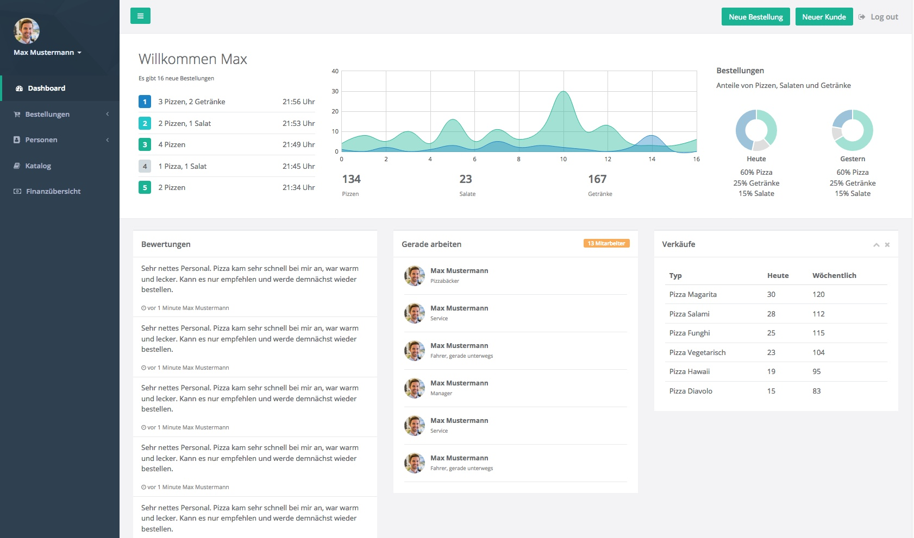
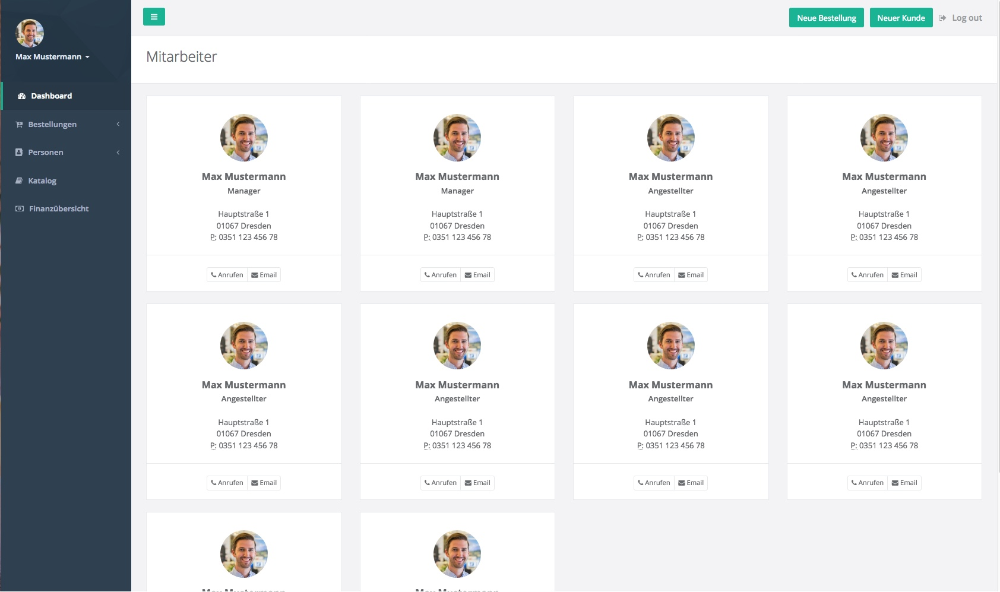

:project_name: Papas Pizza
:doctype: book
:numbered:
:source-highlighter: highlightjs

== GUI Prototyp

In diesem Abschnitt wird beschrieben, auf welche Art und Weise das Entwicklerteam plant, das Frontend für die Software
zu gestalten. Da der Kunde keinen konkreten Wunsch geäußert hat, ob er konkrete Entwürfe den Dialogkarten vorzieht,
haben wir für die wichtigsten Ansichten bereits fertige Entwürfe angefertigt und die restlichen Ansichten werden durch
Dialogkarten beschrieben.

Auf jeder Ansicht befindet sich auf der linken Seite eine Navigation, von der der Nutzer zu jeder Zeit zu jeder anderen
Ansicht navigieren kann.

Es soll erwähnt sein, dass die Entwürfe nicht unbedingt dem finalen Produkt entsprechen müssen, sondern eher dazu dienen,
dem Kunden ein Gefühl dafür geben sollen, wie das finale Produkt aussehen könnte.

Da wir für das Projekt das http://webapplayers.com/inspinia_admin-v2.8/[Inspina Theme] benutzen werden, sind die konkreten
Entwürfe gleich in HTML erstellt wurden, um später Entwicklungszeit zu sparen und den Kunden ein möglichst präzises
Gefühl für das finale Produkt zu vermitteln.

=== Dashboard

Das Dashboard ist die Ansicht, auf der jeder Angestellte landen soll, nachdem er sich eingeloggt hat. Es enthält
Buttons in der oberen, rechten Ecke, für die Aktionen, die der Angestellte am meisten benutzt. Im Falle des normalen
Angestellten ist das das Erstellen von neuen Bestellen und das Anlegen von neuen Kunden. Ansonsten sind keine weiteren
Eingaben für diese Ansicht geplant.

=== Kundenverwaltung
image::./images/GUI/Kunden.jpeg[Kundenverwaltung, title="Übersicht über alle Kunden"]

Diese Ansicht dient der Verwaltung des Kundenstammes. Die Liste zeigt einen Ausschnitt des Kundenstammes und mithilfe
eines Seitenumbruches können weitere Kunden eingesehen werden. Zudem kann ein Angestellter mittels des Suchfeldes
speziell nach einem Kunden suchen. Klickt der Angestellte auf einen Nutzer, werden die Details auf der rechten Seite
angezeigt und können dort auch direkt bearbeitet werden.

=== Mitarbeiterverwaltung

Diese Ansicht dient der Verwaltung des Personals. Aufgrund der geringeren Anzahl von Angestellten wurde hier auf eine
einfache Liste verzichtet und eine Darstellung gewählt, die eher einem Addressbuch entspricht. Ein normaler Angestellter
hat in dieser Ansicht lediglich Leserechte und nur ein Manager würde in der Kopfzeile noch Aktionen angezeigt bekommen,
um Nutzer hinzufügen. Weiterhin muss mit dem Kunden besprochen werden, ob die hier angezeigten Informationen über einen
Angestellten ausreichend sind oder ob die einzelnen Karten auf ein detailiertes Profil des Mitarbeiter verlinken sollen.

=== Katalog
image::./images/GUI/Katalog.jpeg[Katalog, title="Lagerverwaltung"]

Auf dieser Seite kann das Lager der Filiale verwaltet werden. Mithilfe der Tabs können sowohl die reinen Zutaten im Lager
verwaltet werden, aber auch Pizzen und Salate vorkonfiguriert werden. Die Ansicht gibt es auch eine schnelle Übersicht
darüber, wie viel von einem Item noch im Lager ist bzw. ob alle Zutaten für eine Pizza noch vorrätig sind und indiziert
bei einem geringen Lagerbestand mit einem farbigen Label einen geringe, vorrätige Menge. Klickt der Nutzer auf einen
Listeneintrag, werden auf der rechten Seite die Details angezeigt. Hier können auch Konfigurationen für Pizzen und Salate
geändert werden. Der Manager sieht zusätzlich noch Aktionen, um weitere Items hinzuzufügen und Zutaten nachzubestellen.

=== Erstellen von Bestellungen

In dieser Ansicht kann ein Angestellter eine neue Bestellung erstellen. Der Hauptteil wird eine Liste sein, deren Einträge
verschiedene Items in der Bestellung repräsentieren. Per Button kann der Angestellte neue Einträge zu der Bestellung
hinzufügen. Jeder Eintrag soll ein Dropdown mit allen möglichen Items aus dem Katalog umfassen und einem Zahlenfeld,
in der die Quantität eingegeben werden kann. Bei jeder Änderung aktualisiert sich der Betrag für dieses Item, der sich
aus dem Einzelpreis multiplizert mit der Quantität zusammensetzt. Wählt der Angestellte eine Pizza aus, wird zu dem
Eintrag wiederum eine Liste hinzugefügt, in der die einzelnen Komponenten der Pizza aufgelistetet sind und zu der ebenfalls
per Button neue Einträge hinzugefügt werden können. Somit kann der Mitarbeiter beliebig viele Sonderwünsche der Kunden
eingeben.

Weiter unten kann der Mitarbeiter auswählen, ob es sich um die Bestellung eines Neukundens oder eines Bestandskunden
handelt. Bestellt ein Neukunde, wird der Angestellte aufgefordert, die Daten des Kundens zu erfragen und einzugeben.
Bestätigt er dann die Bestellung, wird der Kunde automatisch im System angelegt und erhält mit der Rechnung ebenfalls
automatisch seine neue TAN. Handelt es sich jedoch um einen Bestandskunden, wird statt der Felder für Kundendaten
lediglich ein Feld angezeigt, in welches der Angestellte die letzte TAN des Kunden eingeben muss. Nur wenn die TAN korrekt
ist, kann er die Bestellung erstellen.

=== Öfen

In dieser Ansicht soll für jeden Ofen eine Karte angezeigt werden, in der auch die Liste von Pizzen angezeigt wird, die
sich in der Warteschlange des Ofens befinden. Der Manager soll hier auch eine Aktion sehen können, mit der er Öfen
hinzufügen und löschen kann.

=== Finanzübersicht

Diese Ansicht wird nur für den Manager sichtbar sein. Hier werden einige Diagramme angezeigt, die den Verlauf des Gewinnes
anzeigen (letzte Woche, letzter Monat, letztes Jahr). Zudem sieht er eine Liste aller Bestellungen und kann über einige
Eingabefelder steuern, für welchen Zeitraum Bestellungen angezeigt werden. Die genauen Optionen müssen noch mit dem
Kunden besprochen werden.

=== Login / Logout
image::./images/GUI/Login.jpeg[Login, title="Login-Maske"]

Auf dieser Seite können sich registrierte Nutzer mit ihrem Nutzernamen und Passwort anmelden. Weder ein Link zum
Registrieren noch eine dedizierte Seite zur Registrierung ist sinnvoll, da jeder Nutzer durch einen Manager angelegt
werden soll, da ein Zugang zu dem System an einen gültigen Arbeitsvertrag mit der Filiale geknüpft ist.
