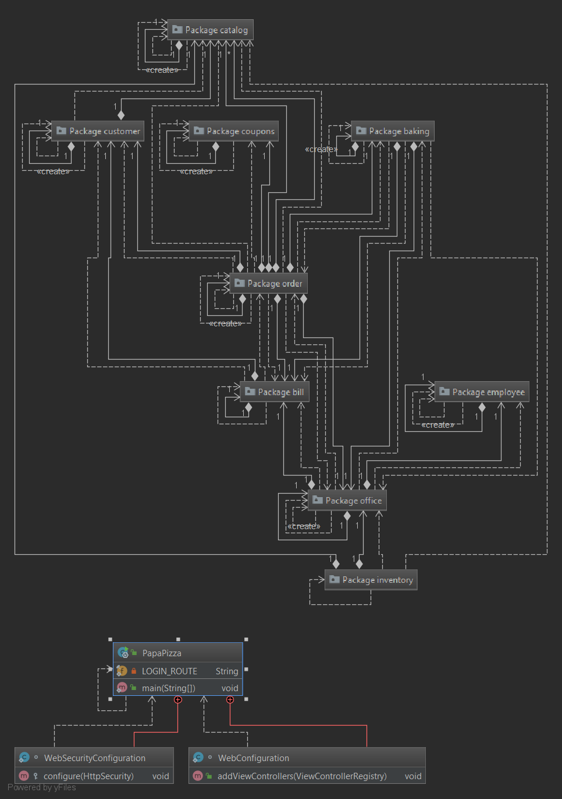
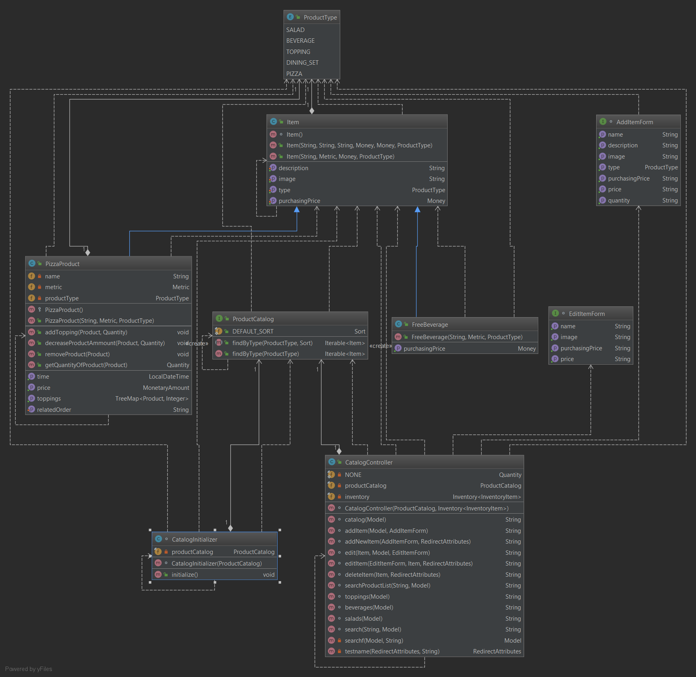
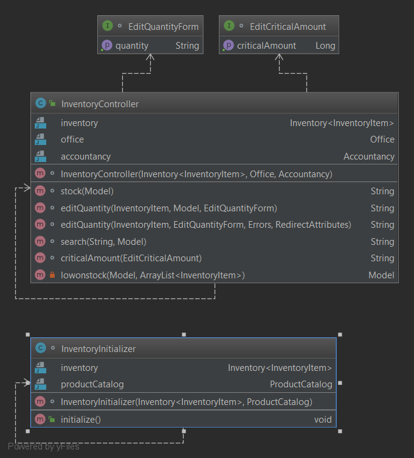
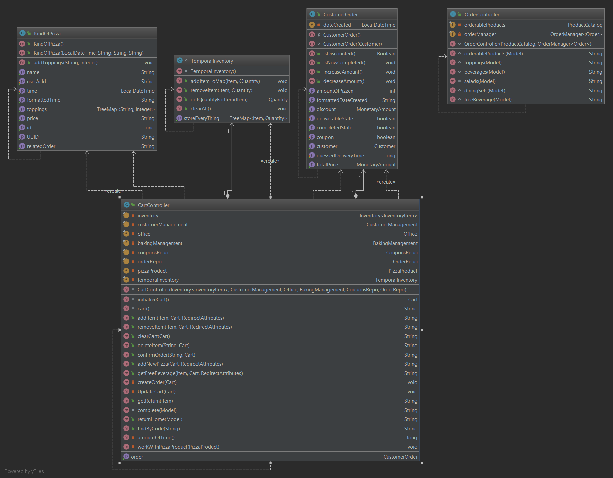
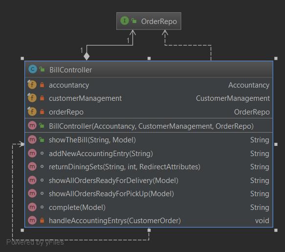
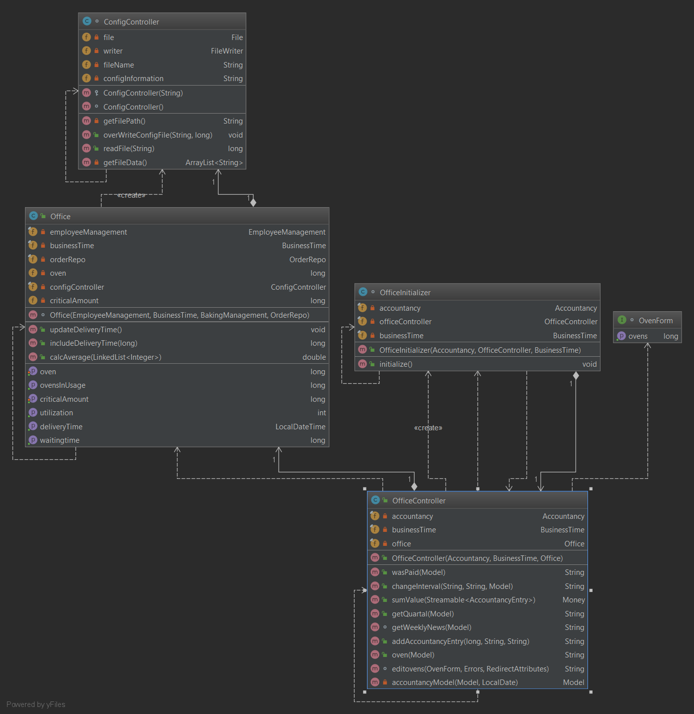
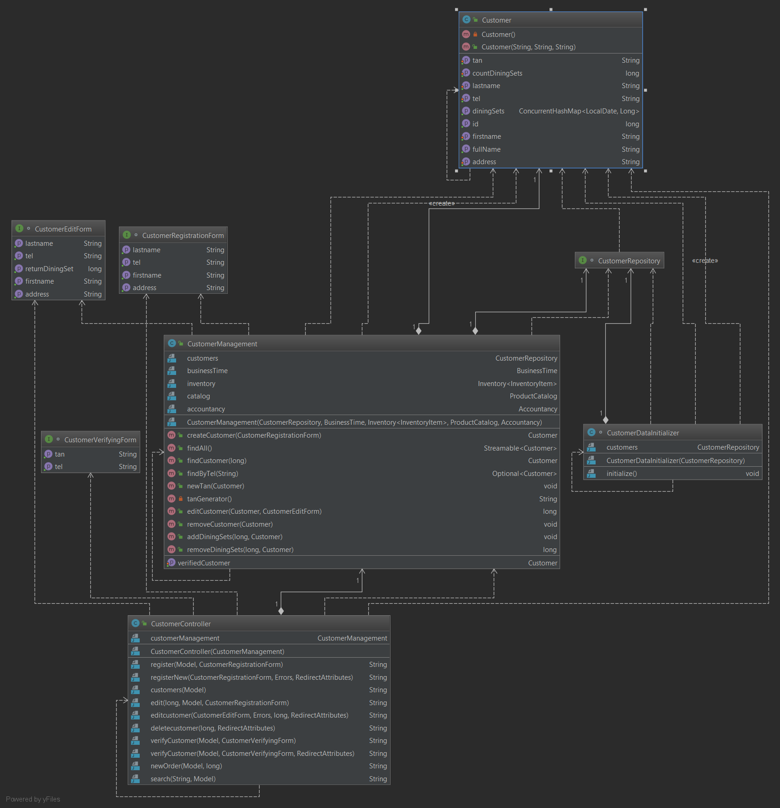
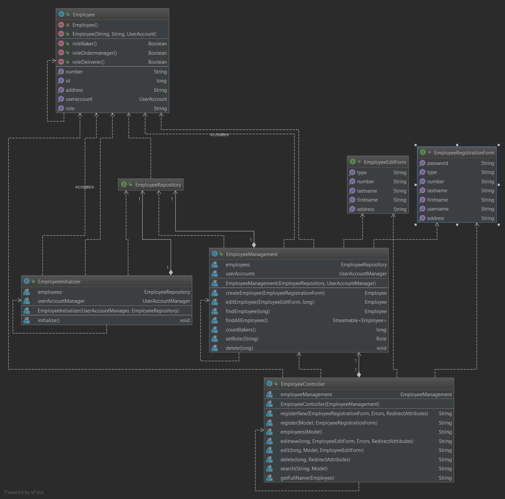
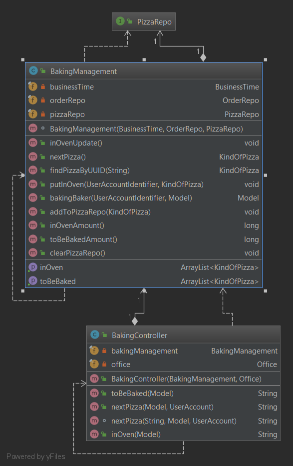
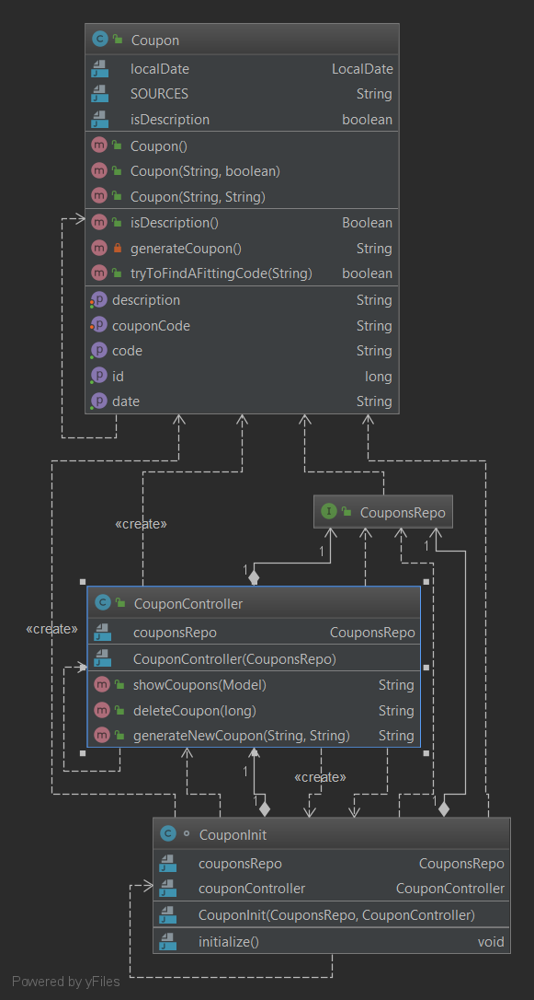

= Entwicklerdokumentation

== Einführung und Ziele
* Aufgabenstellung
* Qualitätsziele

Die Software soll eine intuitive und leicht verständliche Benutzeroberfläche besitzen, um Mitarbeitern schnellen Zugriff zu ermöglichen. Interaktionen zwischen Mitarbeitern ist hier, aufgrund des Datenaustauschs, sehr wichtig und muss klar strukturiert werden.
Sie soll daher einen „aufgeräumten“ Eindruck erwecken und dennoch ein hohes Maß an Funktionalität bieten.

Eine großartige Erweiterung der Software wird nicht gefordert. Es sollen lediglich weitere Zutaten, Mitarbeiter und Kunden dem Datensatz hinzugefügt, entfernt oder verändert werden können. Die dafür benötigte Funktionalität wird bereitgestellt.

Stabilität ist ein weiterer wichtiger Aspekt unserer Software. Sie muss zuverlässig arbeiten und darf im Betrieb, da „Papa Pizza“ drauf angewiesen ist, nicht ausfallen. Auch ihre Performance sollte dementsprechend sein.

Sicherheit steht in dieser Software nicht an oberster Stelle. In die internen Bereiche wird man nur durch gehashte Userdaten gelangen, darüber hinaus werden die Mitarbeiter nur in Bereiche unterteilt werden.

Da es sich um eine Desktop-Anwendung handelt, welche nicht zwangsläufig auf mobilen Endgeräten abgebildet werden muss, spielt Skalierbarkeit eine nicht vorrangige Rolle.

== Randbedingungen			
* Hardware-Vorgaben
* Software-Vorgaben
* Vorgaben zum Betrieb des Software

[Randbedingungen]
[options="header", cols="1h,4"]
|=======================
|*Hardware-Vorgaben* |
|Prozessor:             | Mindestens Pentium 2 266 MHz-Prozessor
|Grafikkarte            |fast 2D graphics card (2 MB required for 1024 x 768)
|RAM                    |128 MB oder mehr
|Datenträger  |124 MB für JRE; 2 MB für Java Update
|Bildschirm  |16:9 aspect ratio
|=======================

[options="header", cols="1h,4"]
|=======================
|*Software-Vorgaben*    |
|Betriebssystem         | Mindestens Windows Vista SP2
|Browser                    |HTML5 fähig
|=======================

[options="header", cols="1h,3"]
|=======================
|*Vorgaben zum Betrieb der Software* |
|Programmiersprache     |JAVA 8 mit Spring
|Frameworks             |Salespoint
|Template-Engine        |Thymeleaf
|=======================

== Kontextabgrenzung
* Externe Schnittstellen:

Dieses Projekt benutzt den Salespoint Framework der TU-Dresden genau so wie den Spring Framework.

== Lösungsstrategie
Für dieses Projekt wird eine Java-Web-Application programmiert die das “Sales-Point” Framework verwendet und erweitert. Es wird dafür die JAVA-Version 8 mindestens benötigt. Weiterhin wird thymeleaf, semantic UI und Spring benutzt. Die verschieden Komponenten der Software werden in drei große Bereiche unterteilt: die Finanzabteilung mit den wichtigen Rechnung der Filiale “Papa Pizza” (Finanz_Package), der Bestellkomponente, der die Lager- und Bestellverwaltung beinhaltet (Catalog_Package + Order_Package) und die Benutzerverwaltung (User-Package). Es wird auf Basis von Controllern gearbeitet (MVC-Pattern), deshalb wird jede unterscheidbare Funktionalität der Software von diesen getrennt.

== Bausteinsicht

_PapaPizza Packagediagram:_

_Product Management Package:_

_Order Package:_

_Accounting Package:_

_User Package:_

_Baking Package:_

_Coupon Package:_

== Entwurfsentscheidungen
* Architektur
* Verwendete Muster

_Singleton_:
Die verschiedenen Controller Klassen sind nach dem Singleton Muster aufgebaut, da nur eine Instanz von jeder erzeugt werden muss.

* Persistenz

Mitarbeiterdaten genau so wie Kundendaten werden nachhaltig im System gespeichert und können je nach Bedarf geändert werden. Diese Daten werden in getrennten Datenbanken gespeichert, um prophylaktisch einer Datenkorruption vorzubeugen.

* Benutzeroberfläche

[appendix]
== Glossar
