= Pflichtenheft Pizzaservice Papa Pizza
:toc: macro
:toc-title:
:numbered:
:project_name: Pizzaservice
== __{project_name}__

[options="header"]
[cols="1, 1, 2, 2, 4"]
|===
|Version | Status      | Bearbeitungsdatum   | Autoren(en) |  Vermerk
|1.1     | In Arbeit   | 28.10.2018       a| * Felix Fischer 
* Emely Himmstedt
* Marine Lafin
* Toni Tanneberger
* Moritz Voigt       | Erste grobe Vollversion
|===

== Inhaltsverzeichnis
toc::[]

== Zusammenfassung
In diesem Dokument werden Einigungen über die Spezifikationen des Programms zwischen Auftraggeber und Developern schriftlich festgehalten, sowie Rahmenbedingungen geschaffen, um eine verbindliche Grundlage zwischen beiden Parteien zu schaffen. 

Das Dokument beinhaltet daher einen Überblick über den Fertigungsprozess der vom Auftraggeber gewünschten Software, eine vorläufige Darstellung der Funktionsweise, dargestellt durch Diagramme und MockUps, sowie eine detaillierte Beschreibung der geforderten und auszuliefernden Aufgabenpunkte, welche das System erfüllen muss.

Gewisse Änderungen im Aufbau der Programmstruktur sind daher nicht auszuschließen und den Developern vorbehalten.

== Aufgabenstellung und Zielsetzung

Der Pizza-Service Papa Pizza liefert Pizzen und Getränke an seine Kunden auf telefonische
Bestellung frei Haus. Da man bei Papa Pizza schlechte Erfahrungen mit "Telefonscherzen"
gemacht hat, laufen die Bestellungen wie folgt:

- Neue Kunden tätigen ihre erste Bestellung persönlich in der Papa Pizza-Filiale. Dabei werden die Kundendaten (Name, Vorname, Adresse, Telefonnummer) aufgenommen. Mit der Rechnung erhält der Kunde seine erste TAN (Transaktionsnummer).
- Im Regelfall bestellen Kunden telefonisch und weisen sich dabei mit ihrer Telefonnummer und TAN aus. Damit ist die TAN für den Kunden "verbraucht".
- Bei Auslieferung erhalten Kunden mit der Rechnung eine neue TAN.
- Wer seine Pizza persönlich abholt, erhält einen Rabatt von 10%.

Die Kunden können sich ihre Pizzas aus dem reichhaltigen Angebot an Zutaten individuell
zusammenstellen. Getränke und Salate werden bei Papa Pizza natürlich ebenfalls angeboten.
Bei einem Bestellwert von über 30 EUR erhält der Kunde ein Gratisgetränk.
Pizzas werden in den verfügbaren Öfen im 5-Minuten-Takt gebacken, d.h. alle 5 Minuten
kann eine weitere Pizza in einen der Öfen geschoben werden. Da die Anzahl der benötigten
Öfen und Pizzabäcker vom Kundenandrang abhängt, wird sie vierteljährlich an die aktuellen
Bestellungszahlen angepasst.
Bei Annahme einer Bestellung wird diese zum nächstmöglichen Zeitpunkt eingeplant und
dem Kunden der voraussichtliche Lieferzeitraum genannt (heißt: wird dem Mitarbeiter nach Eintragen der Bestellung zusammen mit dem Gesamtpreis angezeigt). Die Lieferboten fahren
viertelstündlich die fertig bearbeiteten Bestellungen aus.
Bei Bedarf wird eine Pizza gegen eine Kaution von 15 EUR mit der beliebten Papa Pizza-
Essgarnitur (Becher, Riesenteller, Besteck) geliefert. Die Garnituren können innerhalb von
vier Wochen in der Filiale oder beim Auslieferer zurückgegeben werden. Ansonsten verfällt
die Kaution und gilt als Kaufpreis.
Von Ihrer Software erwartet Papa Pizza eine angemessene Unterstützung aller Vorgänge
einschließlich der Pflege des Kundenstamms (mit TAN-Verwaltung), des Personalstammes (Aufnahme und Aktuallisierbarkeit von Daten)
und des laufenden Sortiments (dessen Zusammenstellung und Preise sich kontinuierlich
ändern) sowie der wöchentlichen Abrechnungen(?) der Filialen mit der Zentrale.
Die ausgelieferte Software soll die Vorgänge in jeweils einer Filiale regeln. Eine zentrale Verwaltung der einzelnen Filialen ist nicht angedacht.

== Produktnutzung 
Dieser Abschnitt soll einen Überblick darüber geben, wie das vorgesehene Produkt nach der Fertigstellung zu verwenden sein wird.
Die Software (Web Anwendung) soll genutzt werden um Kunden des Unternehmens "Papa Pizza" einen aktuellen Online Katalog anzuzeigen. Das Erstellen und der Kauf individuell gestaltbarer Pizzen, Getränke und andere Angebote soll ermöglicht werden. Weiterhin soll das System zur Verwaltung des Personals und des Lagers verwendet werden und den Bestell- und Fertigungsprozess des Unternehmens "Papa Pizza" koordinieren.

Das System soll verfügbar und optisch optimiert sein für Mozilla Firefox (Version 62.0.3+).

Die vorgesehenen Nutzer sind die Kunden von "Papa Pizza", die mit der typischen Navigation einer Website vertraut sein sollten, sowie die Mitarbeiter und Filialleiter (Administratoren) der "Papa Pizza"-Filialen, die zur Nutzung der Anwendung kein tieferes technisches Verständnis besitzen müssen. Insgesamt soll durch eine intuitive Oberfläche die Einarbeitung in das System möglichst selbstständig erfolgen können.

Das System soll keine technische Wartung benötigen. Alle Daten sollen in einer persistenten Datenbank gespeichert werden und über die Anwendung verfügbar sein.

== Interessensgruppen (Stakeholders) 

Hier sind jegliche Personen(-gruppen) (reale oder juristische) benannt, die Bedeutung für die Ansprüche des Systems haben. In der unteren Tabelle, werden diese Interessengruppen aufgelistet. Außerdem wird die Priorität der Interessengruppen gewichtet (um leichter Entscheidungen zu treffen, sollten die Ansprüche miteinander im Widerspruch stehen). Es erfolgt auch eine kurze Auflistung der bedeutendsten Ziele dieser Interessengruppen, welche durch die Anwendung unterstützt werden sollen. Die angegebenen Prioritäten liegen in einer Skala von 1 (niedrigste Priorität) bis 5 (höchste Priorität).

[options="header", cols="2, ^1, 4, 4"]
|===
|Name
|Priorität
|Beschreibung
|Ziele

|Papa Pizza
|5
|primärer Kunde (Auftraggeber) des Projektes
a|
- Automatisierung von Bestellvorgängen
- Digitale Verarbeitung von Bestellungsdaten um Abrechnungen zu erstellen
- Optimierung interner Abläufe
- Variable Aufnahme neuer Produkte
- Bestandsübersicht

|Kunden
|4
|Hauptzielgruppe, sollen Bestellzahlen erhöhen
a|
- Einfach einsehbarer Katalog
- Intuitive Bedienung
- Erhalt relevanter Information
- Seriöse Wirkung

|Papa Pizza Mitarbeiter
|3
|Primäre Nutzer des Systems
a|
- Erleichterung der Bestellungsaufnahme
- Aussagekräftige Bestellungsbeschreibungen
- Übersicht über Lagerbestand
11 
|Filialleiter (Administratoren)
|2
|Nutzer welche die Applikation verwalten
a|
- Übersicht über alle Daten im System
- Daten und Prozessverwaltung
|===

== Systemgrenze und Top-Level-Architektur

=== Kontextdiagramm

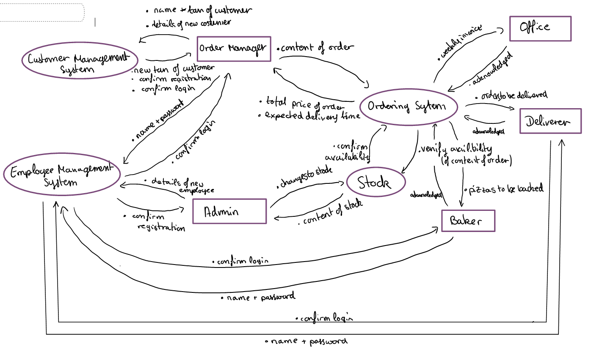

=== Top-Level-Architektur

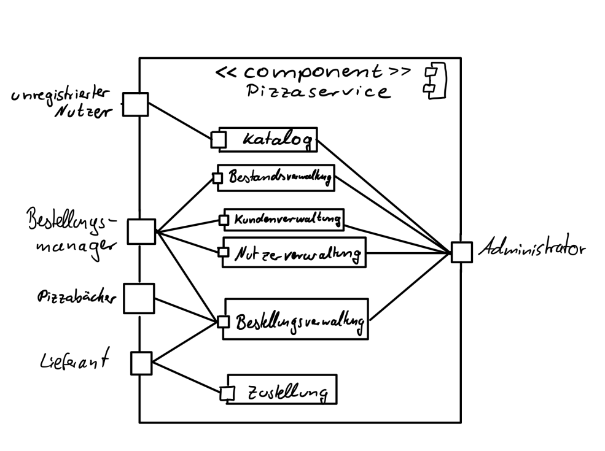

== Anwendungsfälle

=== Akteure 

[options="header"]
[cols="1,4"]
|===
|Name |Beschreibung
|Benutzer (User)                    |steht stellvertretend für jede Person, die mit dem System interagiert
|Kunde von Papa Pizza (customer, unregistered User)    |Sieht Angebotskatalog ein
|Bestellmanager (Order Manager)    |Trägt Kundendaten ein, nimmt Bestellung auf
|Filialleiter (Admin)            |Nimmt neue Waren und Mitarbeiter auf, verwaltet Warenbestand
|Pizzabäcker (Baker)            |Braucht Übersicht über georderte Pizzen
|Lieferant (Deliverer)            |braucht Zuordnung Order -> Adresse, bestätigen Lieferung

|===

=== Überblick Anwendungsfalldiagramm 
Anwendungsfall-Diagramm, das alle Anwendungsfälle und alle Akteure darstellt

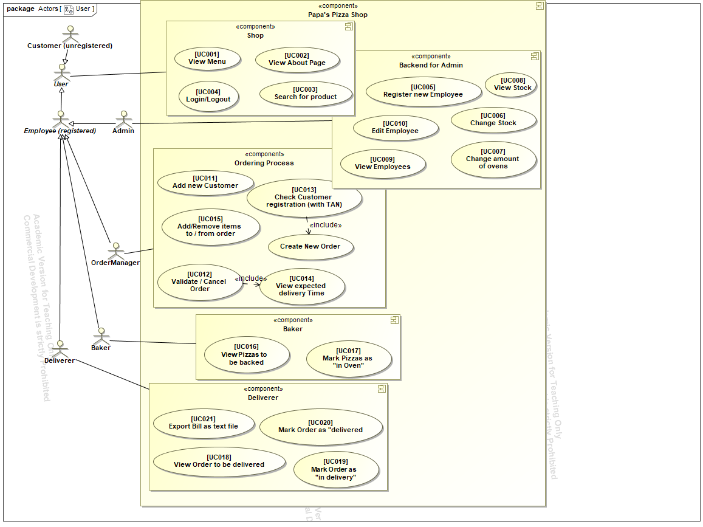

=== Anwendungsfallbeschreibungen 
Dieser Unterabschnitt beschreibt die Anwendungsfälle. In dieser Beschreibung müssen noch nicht alle Sonderfälle und Varianten berücksichtigt werden. Schwerpunkt ist es, die wichtigsten Anwendungsfälle des Systems zu finden. Wichtig sind solche Anwendungsfälle, die für den Auftraggeber, den Nutzer den größten Nutzen bringen.

_Component „Shop“:_

[[UC001]]
[cols="1h,3"]
|===
|ID                         |**<<UC001>>**
|Name                       |View Menu
|Beschreibung              |Jeder Besucher der Website von Papa Pizza muss die Menü-Seite sehen können. Dort befindet sich eine Liste der bestellbaren Waren, in 3 Kategorien unterteilt: die Pizzabeläge, Salate und die Getränke mit deren Beschreibung, Preis und Abbildung.
|Akteure                    |User, Customer (unregistered)
|Auslöser                    |Auf den richtigen Navigationselement klicken der zur Menü-Seite führt
|Vorbedingung(en)          a|-
|Nötige Schritte          a|1.       Benutzer klickt auf das Navigationselement  „Menü“
2.       Bestellbare Waren werden dem Benutzer angezeigt
|===

[[UC002]]
[cols="1h,3"]
|===
|ID                         |**<<UC002>>**
|Name                       |View About Page
|Beschreibung              |Jeder Besucher der Website von Papa Pizza muss die About-Seite sehen können. Dort befindet sich ein kurzer Text zur Firma Papa Pizza.
|Akteure                    |User, Customer (unregistered)
|Auslöser                    |Auf den richtigen Navigationselement klicken der zur About-Seite führt
|Vorbedingung(en)          a|-
|Nötige Schritte          a|1.       Benutzer klickt auf das Navigationselement  „Über Uns“
2.       "Über uns" wird dem Benutzer angezeigt
|===

[[UC003]]
[cols="1h,3"]
|===
|ID                         |**<<UC003>>**
|Name                       |Search for product
|Beschreibung              |Jeder Besucher der Website von Papa Pizza muss mit Stichwörtern eine Ware im Menü finden können.
|Akteure                    |User, Customer (unregistered)
|Auslöser                    |Auf der Menü Seite, auf dem Such Knopf drücken und Stichwort eingeben
|Vorbedingung(en)          a|-
|Nötige Schritte          a|1.       Benutzer klickt auf das Navigationselement  „Menü“
2.       Benutzer klickt auf dem Knopf "Suchen" und gibt im Suchfeld der Name des gesuchten Objekt
3.       Objekt wird angezeigt
|===

[[UC004]]
[cols="1h,3"]
|===
|ID                         |**<<UC004>>**
|Name                       |Login/Logout
|Beschreibung              |Alle Benutzer (User) können die Loginseite aufrufen. Bei erfolgreicher Anmeldung werden abhängig von Ihrer Rolle im Unternehmen (Admin, Order Manager, Baker, Deliverer) verschiedene Inhalte angezeigt.
|Akteure                    |User
|Auslöser                    |Login: Der Benutzer (User) möchte auf weitere Inhalte zugreifen
Logout: Der Benutzer (User) möchte zurück zur Menü-Ansicht
|Vorbedingung(en)          a|Login: Der Benutzer ist noch nicht eingeloggt
Login: Der Benutzer (User) ist eingeloggt
|Nötige Schritte          a|Login:

1.       Der Benutzer (User) klickt auf dem Knopf mit der Beschriftung „Login“.
2.       Der Benutzername und das Passwort werden eingegeben.
3.       Der Benutzer ist jetzt eingeloggt und die passenden Inhalte werden angezeigt.

Logout:

1.       Der Benutzer (User) klickt auf dem Knopf mit der Beschriftung „Logout“.
2.       Der Benutzer wird ausgeloggt und wird zur Ansicht für nicht eingeloggte Benutzer umgeleitet.

|===

[[UC005]]
_Component „Backend for Admin“:_
[cols="1h,3"]
|===
|ID                         |**<<UC005>>**
|Name                       |Register new Employee
|Beschreibung              |Der eingeloggte Benutzer, mit der Rolle Admin, kann einen neuen Mitarbeiter registrieren.
|Akteure                    |Admin
|Auslöser                    |Der eingeloggte Benutzer mit der Rolle Admin wählt den Tab „Mitarbeiter hinzufügen“.
|Vorbedingung(en)          a|Der Benutzer ist eingeloggt und hat die Rolle Admin.
|Nötige Schritte          a|1.       Der eingeloggter Benutzer mit der Rolle Admin wählt den Tab „Mitarbeiter“
2.       Der Admin wählt die Option „Mitarbeiter hinzufügen“
3.       Der Admin füllt die nötigen Felder, mit dem gewünschten Benutzernamen, Passwort und der Rolle, sowie den Namen, die Telefonnummer und die Adresse des neuen Mitarbeiters aus.
4.       Das System überprüft die Verfügbarkeit des Benutzernamen.

**                  Falls schon vorhanden:
Eine Fehlermeldung wird dem Benutzer angezeigt

**                Falls nicht vorhanden:
 Ein neues Benutzerkonto wird, mit den angegebenen Daten, im System hinterlegt
|===

[[UC006]]
[cols="1h,3"]
|===
|ID                         |**<<UC006>>**
|Name                       |Change Stock
|Beschreibung              |Der eingeloggte Benutzer, mit der Roll Admin, kann die Anzahl einer Ware im Lager(Stock) ändern.
|Akteure                    |Admin
|Auslöser                    |Der eingeloggte Benutzer mit der Rolle Admin wählt den Tab “Lager” und entweder die Option „Neues Produkt aufnehmen“, „Produkt bearbeiten“ oder „Produkt Entfernen“.
|Vorbedingung(en)          a|Der Benutzer ist eingeloggt und hat die Admin Rolle
|Nötige Schritte          a|1.       Der eingeloggter Benutzer mit der Rolle Admin wählt den Tab „Lager“
--
_Um Waren dem Lager hinzuzufügen:_
--
**                 Der Admin wählt die Option: „Neues Produkt aufnehmen“
**                 Der Admin füllt die nötigen Felder, mit den gefragten Informationen zur Ware, aus (Name, Einkaufspreis, Verkaufspreis, Typ, Beschreibung, Abbildung)
**               System checkt ob der eingegebene Name verfügbar ist
***    Falls schon vorhanden:
eine Fehlermeldung wird dem Benutzer angezeigt
***    Falls noch nicht vorhanden
Eine neue Ware wird mit den angegebenen Daten im System hinterlegt
--
_Um die Anzahl einer Ware zu ändern:_
--
**                Der Admin wählt die Option: „Produkt bearbeiten“
**               Er wählt die “Anzahl”-Angabe der gewünschten Ware an.
**             Ein neuer numerischer Wert wird eingegeben
--
_Um eine Ware aus dem Lager zu entfernen:_
--
**                  Der Admin wählt die Option: „Produkt Entfernen“
**                Die gewünschte Ware wird ausgewählt
|===

[[UC007]]
[cols="1h,3"]
|===
|ID                         |**<<UC007>>**
|Name                       |Change amount of Ovens
|Beschreibung              |Der eingeloggte Benutzer, mit der Rolle Admin, kann die Anzahl der Öfen ändern.
|Akteure                    |Admin
|Auslöser                    |Der eingeloggte Benutzer mit der Rolle Admin wählt den Tab „Öfen“.
|Vorbedingung(en)          a|Der Benutzer ist eingeloggt und hat die Rolle Admin.
|Nötige Schritte          a|1.       Der eingeloggte Benutzer mit der Rolle Admin wählt den Tab „Öfen“
2.       Der Admin trägt in das Feld für die Anzahl der Öfen eine numerische Angabe ein.
|===

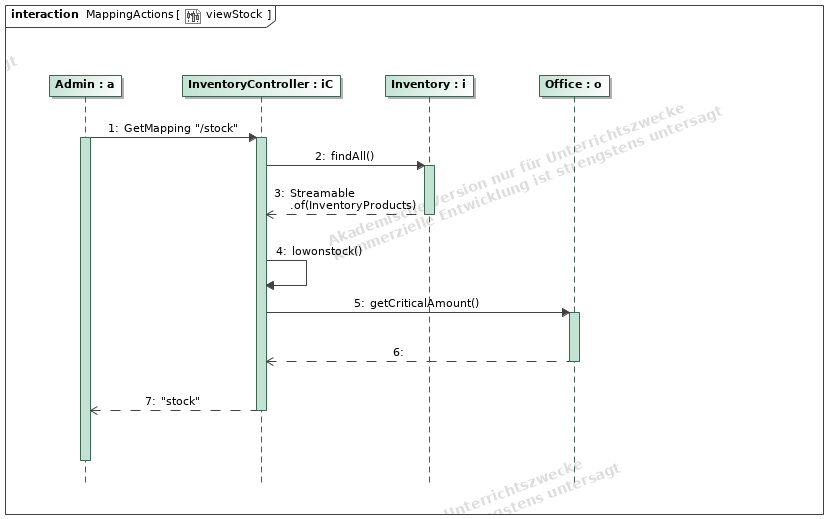

[[UC008]]
[cols="1h,3"]
|===
|ID                         |**<<UC008>>**
|Name                       |View Stock
|Beschreibung              |Dem eingeloggten Benutzer mit der Rolle Admin wird eine Liste der Waren, die im Lager vorhanden sind, angezeigt.
|Akteure                    |Admin
|Auslöser                    |Der eingeloggte Benutzer mit der Rolle Admin wählt den Tab „Lager“.
|Vorbedingung(en)          a|Der Benutzer ist eingeloggt und hat die Admin Rolle
|Nötige Schritte          a|1.       Der Admin wählt den Tab „Lager“ aus
2.       Eine Liste der Waren im Lager wird dem Benutzer (Admin) angezeigt mit deren Kategorie, Name, Einkaufspreis, Verkaufspreis, Anzahl, Beschreibung und Abbildung.
|===

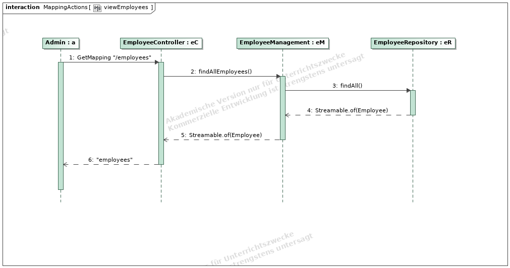

[[UC009]]
[cols="1h,3"]
|===
|ID                         |**<<UC009>>**
|Name                       |View Employee
|Beschreibung              |Der eingeloggte Benutzer mit der Rolle Admin kann eine Liste der registrierten Mitarbeiter der Firma Papa Pizza mit deren Attributen einsehen.
|Akteure                    |Admin
|Auslöser                    |Der eingeloggte Benutzer mit der Rolle Admin wählt den Tab „Mitarbeiter“.
|Vorbedingung(en)          a|Der Benutzer ist eingeloggt und hat die Rolle Admin.
|Nötige Schritte          a|1.       Der Admin wählt den Tab „Mitarbeiter“.
2.       Eine Liste der registrierten Mitarbeiter wird dem Admin angezeigt mit deren Benutzername, Passwort und Rolle.
|===

[[UC010]]
[cols="1h,3"]
|===
|ID                         |**<<UC010>>**
|Name                       |Edit Employee
|Beschreibung              |Der eingeloggte Benutzer mit der Rolle Admin kann die Attribute aller registrierten Mitarbeiter der Firma Papa Pizza bearbeiten.
|Akteure                    |Admin
|Auslöser                    |Der eingeloggte Benutzer mit der Rolle Admin wählt den Tab „Mitarbeiter“ und klickt auf dem Knopf "Bearbeiten".
|Vorbedingung(en)          a|Der Benutzer ist eingeloggt und hat die Rolle Admin.
|Nötige Schritte          a|1.       Der Admin wählt den Tab „Mitarbeiter“.
2.       Eine Liste der registrierten Mitarbeiter wird dem Admin angezeigt mit deren Benutzername, Passwort und Rolle.
3.       Der Benutzer klickt auf dem Knopf "Bearbeiten und kann beliebig die Eingaben zum Mitarbeiter ändern.
|===

_Component „Ordering Process“:_
[[UC011]]
[cols="1h,3"]
|===
|ID                         |**<<UC011>>**
|Name                       |Add new Customer
|Beschreibung              |Der eingeloggte Benutzer, mit der Rolle „Order Manager“ kann einen neuen Kunden im System registrieren sodass dem neuen Benutzer seine erste TAN systemextern übermittelt werden kann.
|Akteure                    |Order Manager
|Auslöser                    |Der eingeloggte Benutzer, mit der Rolle Order Manager, wählt den Tab „Neuer Kunde“
|Vorbedingung(en)          a|Der Benutzer ist eingeloggt und hat die Rolle „Order Manager“
|Nötige Schritte          a|1.       Der Benutzer wählt den Tab „Neuer Kunde
2.       Der Admin trägt in die nötigen Felder die Informationen des Kundens ein (Vorname, Name, Adresse und Telefonnummer)
3.       System checkt dass kein Kunde mit der gleichen Telefonnummer existiert.
**                 _Falls schon vorhanden:_ Eine Fehlermeldung wird dem Benutzer angezeigt

**               _Falls noch nicht vorhanden:_
Ein neues Kundenkonto wird mit den angegebenen Daten im System hinterlegt und die neue zufallsgenerierte TAN des Kundens wird angezeigt.
|===

[[UC012]]
[cols="1h,3"]
|===
|ID                         |**<<UC012>>**
|Name                       |Validate / Cancel Order
|Beschreibung              |Während des Bestellprozesses kann eine Bestätigung oder ein Abbruch der Bestellung durch den eingeloggten Benutzer, mit der Rolle Order Manager, erfolgen.
|Akteure                    |Order Manager
|Auslöser                    |Der eingeloggte Benutzer, mit der Rolle Order Manager, wählt den Tab „neue Bestellung aufnehmen“, verifiziert den Kunden  und klickt auf dem Knopf „Liefern“ oder „Bestellung abbrechen“.
|Vorbedingung(en)          a|Der Benutzer ist eingeloggt mit der Rolle „Order Manager“, hat den Kunden mithilfe der angegebenen TAN und der Telefonnummer verifiziert und ist dabei eine Bestellung aufzunehmen.
|Nötige Schritte          a|1.       Der Order Manager wählt den Tab „neue Bestellung aufnehmen“
_Cancel Order:_
--
**              Während der Bestellung klickt der Nutzer auf dem Knopf „Bestellung abbrechen“
**              Die Bestellung wird abgebrochen und der Order Manager wird zu der Bestellung Ansicht zurückgeleitet.
--
_Validate Order:_
--
**              Während der Bestellung klickt der Nutzer auf den Knopf „Liefern“ oder “Selbstabholung”
**              Die Bestellung wird im System abhängig davon, ob es eine Lieferung oder Selbstabholung ist weitergegeben. Der Order Manager kommt zurück zu der Bestellungen-Ansicht.
--
|===

[[UC013]]
[cols="1h,3"]
|===
|ID                         |**<<UC013>>**
|Name                       |Check Customer registration (with TAN)
|Beschreibung              |Der Order Manager verifiziert den Kunden mithilfe der angegebenen TAN und der Telefonnummer um eine neue Bestellung aufnehmen zu können.
|Akteure                    |Order Manager
|Auslöser                    |Der eingeloggte Benutzer, mit der Rolle Order Manager, wählt den Tab „Registrierter Kunde“
|Vorbedingung(en)          a|Der Benutzer ist eingeloggt mit der Rolle „Order Manager“ .
|Nötige Schritte          a|1.       Der Benutzer wählt den Tab „Registrierter Kunde“
2.       Der Order Manager gibt die Telefonnummer und die angegebene TAN in den passenden Feldern an.
3.       Der Kunde wird vom System erkannt und der Order Manager kann jetzt für diesen Kunden Waren bestellen.
|===

[[UC014]]
[cols="1h,3"]
|===
|ID                         |**<<UC014>>**
|Name                       |View expected delivery time
|Beschreibung              |Der eingeloggte Benutzer, mit der Rolle Order Manager, kann sich während der Bestellung die voraussichtliche Lieferzeit der Waren anzeigen lassen.
|Akteure                    |Order Manager
|Auslöser                    |Der eingeloggte Benutzer, mit der Rolle Order Manager, wählt den Tab „neue Bestellung übernehmen“ und verifiziert den Kunden.
|Vorbedingung(en)          a|Der Benutzer ist eingeloggt mit der Rolle „Order Manager“ und ist dabei eine Bestellung aufzunehmen.
|Nötige Schritte          a|1.       Der Order Manager wählt den Tab „neue Bestellung übernehmen und verifiziert den Kunden
2.       Die voraussichtliche Lieferungszeit der Waren wird unter der Bestelloberfläche angezeigt.

|===

[[UC015]]
[cols="1h,3"]
|===
|ID                         |**<<UC015>>**
|Name                       |Add/Remove items to/from Order
|Beschreibung              |Der Order Manager kann verschiedene Waren aus dem Lager zur Bestellung hinzufügen oder von der Bestellung entfernen.
|Akteure                    |Order Manager
|Auslöser                    |Der eingeloggte Benutzer, mit der Rolle Order Manager, wählt den Tab „neue Bestellung übernehmen“ und verifiziert den Kunden.
|Vorbedingung(en)          a|Der Benutzer ist eingeloggt mit der Rolle „Order Manager“, hat den Kunde mithilfe der angegebenen TAN und der Telefonnummer verifiziert und ist dabei eine Bestellung aufzunehmen.
|Nötige Schritte          a|1.       Der Order Manager wählt den Tab „neue Bestellung aufnehmen“ und verifiziert den Kunden.
--
_Add Item to Order:_
--
*                 Während der Bestellung klickt der Nutzer auf dem Knopf „Neuen Artikel annehmen“
*               Der Order Manager wählt die gewünschte Ware und die Ware wird der Bestellung hinzugefügt
--
_Remove Item from Order:_
--
*     Während der Bestellung klickt der Nutzer auf dem Knopf „Artikel entfernen“
*     Der Order Manager wählt die gewünschte Ware und die Ware wird von der Bestellung gelöscht
 

|===

_“Baker”_

[[UC016]]
[cols="1h,3"]
|===
|ID                         |**<<UC016>>**
|Name                       |View Pizzas to be baked
|Beschreibung              |Der eingeloggte Benutzer, mit der Rolle Baker, kann einsehen welche Pizzen noch zu backen sind.
|Akteure                    |Baker(Pizzabäcker)
|Auslöser                    |Der Benutzer ist eingeloggt und hat die Rolle „Baker“.
|Vorbedingung(en)          a|Der Benutzer ist eingeloggt und hat die Rolle „Baker“.
|Nötige Schritte          a|-
|===

[[UC017]]
[cols="1h,3"]
|===
|ID                         |**<<UC017>>**
|Name                       |Mark Pizzas as “In Oven”
|Beschreibung              |Der eingeloggte Benutzer, mit der Rolle Baker, kann Pizzen, die bereit sind gebacken zu werden als „im Ofen“ markieren, wenn sie sich in Bearbeitung befinden.
|Akteure                    |Baker(Pizzabäcker)
|Auslöser                    |Der Benutzer ist eingeloggt und hat die Rolle „Baker“ und klickt auf dem Knopf, neben der betroffenen Pizza, der mit „Im Ofen“ bezeichnet ist.
|Vorbedingung(en)          a|Der Benutzer ist eingeloggt und hat die Rolle „Baker“.
|Nötige Schritte          a|1.       Der Pizzabäcker klickt auf dem Knopf, neben der betroffenen Pizza, die mit „Im Ofen“ bezeichnet ist.
2.       Die Pizza wird als „im Ofen” bezeichnet, verschwindet nach der festgelegten Zeit (5 Minuten) aus der Ansicht des Bakers und wird dem Deliverer als zustellbar angezeigt wenn die Pizza zugestellt werden muss .

|===

_“Deliverer”_

[[UC018]]
[cols="1h,3"]
|===
|ID                         |**<<UC018>>**
|Name                       |View Orders to be delivered
|Beschreibung              |Der eingeloggte Benutzer, mit der Rolle Deliverer, kann einsehen welche Bestellungen noch zuzustellen sind mit den dazu nötigen Informationen wie der Name und Adresse des Kunde genauso wie die der Gesamtpreis.
|Akteure                    |Deliverer (Lieferant)
|Auslöser                    |Der Benutzer ist eingeloggt und hat die Rolle „Deliverer“.
|Vorbedingung(en)          a|Der Benutzer ist eingeloggt und hat die Rolle „Deliverer“.
|Nötige Schritte          a|-
|===

[[UC019]]
[cols="1h,3"]
|===
|ID                         |**<<UC019>>**
|Name                       |Mark Order as “in delivery”
|Beschreibung              |Der eingeloggte Benutzer, mit der Rolle Deliverer, kann Bestellungen, die er zustellt, als “eingesammelt“  konfirmieren.
|Akteure                    |Deliverer (Lieferant)
|Auslöser                    |Der Benutzer ist eingeloggt, mit der Rolle „Deliverer“, und drückt auf den Knopf, neben der betroffenen Bestellung, der mit „Einsammeln“ bezeichnet ist.
|Vorbedingung(en)          a|Der Benutzer ist eingeloggt und hat die Rolle „Deliverer“.
|Nötige Schritte          a|1.       Der Deliverer klickt auf dem Knopf, neben der betroffenen Bestellung, der mit „Einsammeln“ bezeichnet ist.
2.       Die Bestellung  wird als „eingesammelt“ bezeichnet, verschwindet nach der als voraussichtlich berechneten Lieferzeit aus Liste der noch zu liefernden Bestellungen.

|===

[[UC020]]
[cols="1h,3"]
|===
|ID                         |**<<UC020>>**
|Name                       |Mark Order as “delivered”
|Beschreibung              |Der eingeloggte Benutzer, mit der Rolle Deliverer, kann Bestellungen, die er zugestellt hat, als “zugestellt“  konfirmieren.
|Akteure                    |Deliverer (Lieferant)
|Auslöser                    |Der Benutzer ist eingeloggt, mit der Rolle „Deliverer“, und drückt auf den Knopf, neben der betroffenen Bestellung, der mit „Zugestellt“ bezeichnet ist.
|Vorbedingung(en)          a|Der Benutzer ist eingeloggt und hat die Rolle „Deliverer“.
|Nötige Schritte          a|1.       Der Deliverer klickt auf dem Knopf, neben der betroffenen Bestellung, der mit “zugestellt“ bezeichnet ist.
2.       Die Bestellung  wird als „eingesammelt“ bezeichnet, verschwindet nach der als voraussichtlich berechneten Lieferzeit aus der Sicht des Deliverers.

|===

[[UC021]]
[cols="1h,3"]
|===
|ID                         |**<<UC021>>**
|Name                       |Export Bill as TextFile
|Beschreibung              |Der eingeloggte Benutzer, mit der Rolle Deliverer, kann für Bestellungen die dazugehörige Rechnung als Textdatei speichern.
|Akteure                    |Deliverer (Lieferant)
|Auslöser                    |Der Benutzer ist eingeloggt, mit der Rolle „Deliverer“, ist im Menü “zugestellt”und drückt auf den Knopf, neben der betroffenen Bestellung, der mit “Rechnung“ bezeichnet ist.
|Vorbedingung(en)          a|Der Benutzer ist eingeloggt und hat die Rolle „Deliverer“.
|Nötige Schritte          a|1.       Der Deliverer klickt auf dem Knopf, neben der betroffenen Bestellung, der mit “Rechnung“ bezeichnet ist.
2.       Die Rechnung kann als TExtdatei gespeichert werden.
|===

== Funktionale Anforderungen 

=== Muss-Kriterien
[options="header"]
[cols="1h,3"]
|===
|Name                 |Beschreibung
|Authentifikation    a|Die Anwendung muss zwischen öffentlichen und geschäftsinternen Bereichen unterscheiden können, wobei für den Zugang zu nicht öffentlichen Bereichen eine Authentifizierung nötig ist. Wenn der Nutzer im System existiert (Employee), muss es ihm möglich sein sich zu authentifizieren, indem er folgende Informationen bereitstellt:

* Nutzername
* Passwort 
|Mitarbeiter bearbeiten a|Die Anwendung muss es dem Filialleiter (Administrator) ermöglichen, die folgenden Informationen über Mitarbeiter im System einzutragen, zu löschen oder zu bearbeiten:

* Name
* Art der Beschäftigung
* Telefonnummer
* Adresse
|Mitarbeiter löschen    a|Die Anwendung muss es dem Filialleiter (Administrator) ermöglichen, in das System eingepflegte Mitarbeiterdaten wieder zu entfernen und einen Login mit diesen Daten unmöglich zu machen.

|Kundendaten bearbeiten  a| Die Anwendung muss es einem Mitarbeiter ermöglichen, die folgenden Informationen über Kunden in das System einzutragen und zu bearbeiten:

* Kundenname
* Telefonnummer
* Adresse
Eine zufällig erstellte TAN wird im System hinterlegt.
|Kunden löschen    a|Die Anwendung muss es Filialleiter und Bestellungsmanagern ermöglichen, in das System eingepflegte Kundendaten wieder zu entfernen und so eine Bestellungsverifikation mit diesen Daten zu verhindern.
|Kunden verifizieren| Die Anwendung muss es dem Mitarbeiter, der eine Bestellung entgegen nimmt, ermöglichen einen Kunden anhand seiner Telefonnummer und TAN zu verifizieren.
|Bestellung erstellen     |Die Anwendung muss es dem Mitarbeiter ermöglichen eine Telefonbestellung über ein Formular in das System einzupflegen.
|Pizza gestalten| Die Anwendung muss einem Mitarbeiter während der Bestellung die Möglichkeit geben, eine Pizza aus den verfügbaren Zutaten zu erstellen.
|Produktverfügbarkeit überprüfen| Die Anwendung in der Lage sein, während einer Bestellung die Verfügbarkeit der bestellten Produkte zu überprüfen.
|Bestellungen einsehen| Die Anwendung muss es Mitarbeitern und dem Filialleiter ermöglichen, die laufenden Bestellungen einzusehen.
|Rabatt geben| Die Anwendung muss einem Mitarbeiter die Möglichkeit geben, bei Selbstabholung, einem Kunden 10% Rabatt zu geben.
|Gratisgetränk |Die Anwendung muss es ermöglichen, einer Bestellung im Wert von 30 EUR oder mehr, ein wählbares Gratisgetränk hinzuzufügen.
|Besteckset bestellen| Die Anwendung muss ermöglichen bei Ausgabe eines Bestecksets dem Kunden 15 EUR pro Stück zu berechnen und die Anzahl der Bestecksets im Lager anzupassen. Dem System muss für das Besteckset ein Ablaufdatum hinzugefügt werden, dass den Zeitraum definiert, in dem es zurückgegeben werden kann.
|Besteckset Rückgabe| Die Anwendung muss ermöglichen, bei Rückgabe eines Bestecksets, zu überprüfen ob der Rückgabezeitraum eingehalten wurde. Wenn dem so ist, dann muss die Anzahl der Bestecksets im System erhöht werden und der Kautionsbetrag aus der Abrechnung subtrahiert werden. Ansonsten gilt der Kautionsbetrag als Kaufpreis und wird im System verrechnet.
|TAN generieren| Die Anwendung muss in der Lage sein eine zufällig generierte TAN zu erstelle, und diese einem Kunden und einer Rechnung zuzuordnen.
|Voraussichtliche Lieferzeit|Die Anwendung muss eine voraussichtliche Lieferzeit anhand der aktuellen Auslastung errechnen und ausgeben.
|Rechnung erstellen a| Die Anwendung muss in der Lage sein eine Rechnung zu erstellen, die folgende Informationen enthält:

* Liste der bestellten Produkte
* Gesamtpreis der Bestellung
* TAN für die nächste Bestellung
|Rechnungen speichern| Die Anwendung muss in der Lage sein erstellte Rechnungen im System  persistent zu speichern.
|Wöchentlich Abrechnung erstellen a| Die Anwendung muss wöchentlich eine Abrechnung erstellen mit folgendem Inhalt:

* Umsatz
* Kosten
* Gewinn
|Auslastung anzeigen|Die Anwendung muss dem Filialleiter die Auslastung, der letzten drei Monate, aller Öfen und Pizzabäcker ausgeben können. 
|Katalog anzeigen a| Die Anwendung muss den Produktkatalog öffentlich einsehbar machen. Folgende Informationen müssen einsehbar sein:

* Produktname
* Verkaufspreis
|Lager| Die Anwendung muss es ermöglichen Daten über die im Lager vorhanden Produkte persistent zu speichern.
|Lager einsehen| Die Anwendung muss Mitarbeitern und Filialleitern ermöglichen das Lager einzusehen
|Anzahl der gelagerten Produkte verringern | Nach Abwicklung einer Bestellung muss die Anwendung die Menge der im Lager vorrätigen Produkte entsprechend der Bestellung verringern.
|Anzahl der gelagerten Produkte erhöhen| Die Anwendung muss dem Filialleiter(Admin) ermöglichen, die Anzahl der gelagerten Produkte im System an den Bestand anzupassen.
|Bearbeiten der Produkte   a| Die Anwendung muss dem Filialleiter ermöglichen, Produkte dem Katalog hinzuzufügen, aus dem Katalog zu entfernen oder sie zu bearbeiten, indem er folgende Informationen zur Verfügung stellt:

* Produktname
* Produkttyp
* Einkaufspreis
* Verkaufspreis
|Suchleiste|Die Anwendung muss es jedem Nutzer ermöglichen, sich über eine Suchleiste spzielle Produkte anzeigen zu lassen.

|===

=== Kann-Kriterien
Anforderungen die das Programm leisten können soll, aber für den korrekten Betrieb entbehrlich sind.

== Nicht-Funktionale Anforderungen

=== Qualitätsziele

Dokumentieren Sie in einer Tabelle die Qualitätsziele, welche das System erreichen soll, sowie deren Priorität.

1 = nicht wichtig ..
5 = sehr wichtig

[options="header", cols="3h, ^1, ^1, ^1, ^1, ^1"]
|===
|Qualitätsziele             | 1 | 2 | 3 | 4 | 5
|Instandhaltbarkeit    |  |   | x  |   |
|Erweiterbarkeit    | x |   |   |   | 
|Nutzbarkeit                |    |   |  |   | x
|Skalierbarkeit            |   |   | x |   |
|Zuverlässigkeit          |  |   |  | x |
|Sicherheit                  |   | x |   |   |
|Performance             |   |   |   | x |
|===

=== Konkrete Nicht-Funktionale Anforderungen

Beschreiben Sie Nicht-Funktionale Anforderungen, welche dazu dienen, die zuvor definierten Qualitätsziele zu erreichen.
Achten Sie darauf, dass deren Erfüllung (mindestens theoretisch) messbar sein muss.

[options="header", cols="2h, 3, 12"]
|===
|ID
|Name
|Beschreibung

|[[NF001]]<<NF001>>
|Zuverlässigkeit 
a|
Das System sollte alle Vorgänge wie geplant ausführen können ohne auf einen Error weiterzuleiten.

|[[NF002]]<<NF002>>
|Zuverlässigkeit - Uptime
a| Das System soll eine Uptime von mindestens 99% haben.

|[[NF003]]<<NF003>>
|Sicherheit 
a| Die Passwörter sollen als Hash-values gespeichert werden, um Diebstahl zu vermeiden.

|[[NF004]]<<NF004>>
|Nutzbarkeit
a| Die Anwendung sollte für alle Nutzer intuitiv und einfach verständlich zu bedienen sein.

|[[NF005]]<<NF005>>
|Performance
a|
Das System sollte alle Vorgänge in angebrachter Zeit ausführen können ohne den Ablauf des Unternehmens zu beeinträchtigen.
|===

== GUI Prototyp

In diesem Kapitel soll ein Entwurf der Navigationsmöglichkeiten und Dialoge des Systems erstellt werden.
Idealerweise entsteht auch ein grafischer Prototyp, welcher dem Kunden zeigt, wie sein System visuell umgesetzt werden soll.
Konkrete Absprachen - beispielsweise ob der grafische Prototyp oder die Dialoglandkarte höhere Priorität hat - sind mit dem Kunden zu treffen.

=== Überblick: Dialoglandkarte

Die nachfolgende Abbildung zeigt eine an die Pinnwand gezeichnete Dialoglandkarte. Die Karte stellt zusätzlich Buttons dar, mit deren Hilfe die Navigation zwischen den Masken möglich ist..

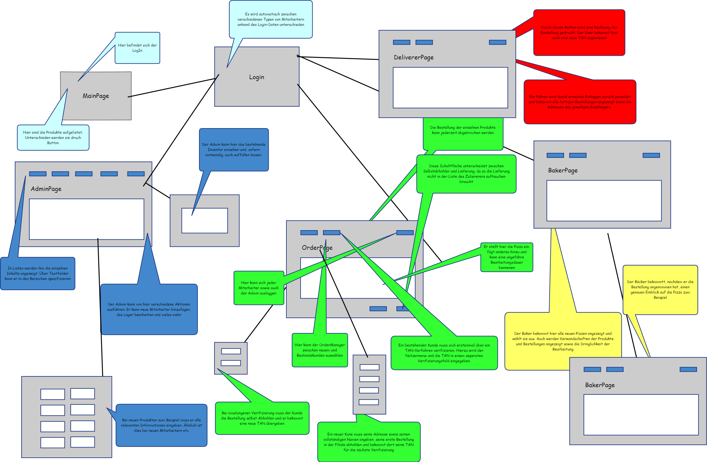

=== Dialogbeschreibung
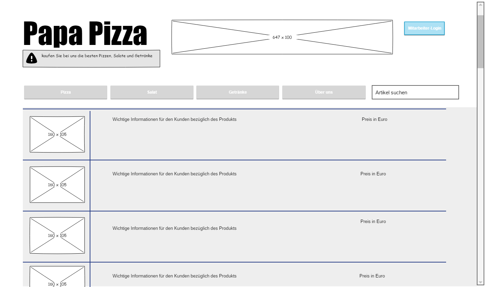
“Startseite”

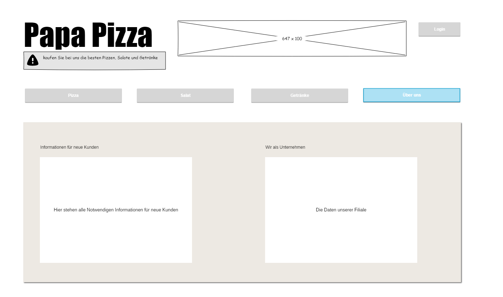
“Über uns - Seite”

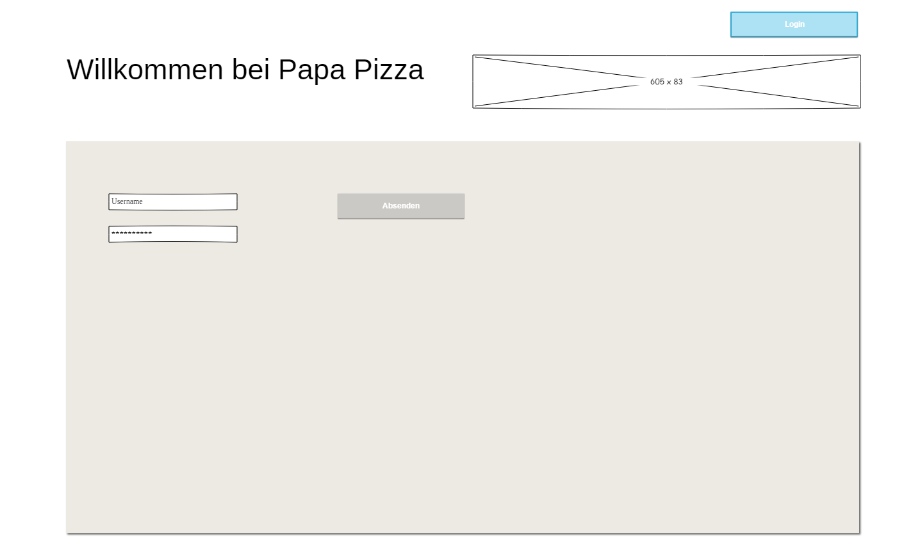
“Login Formular für alle Mitarbeiter und den Filialleiter”

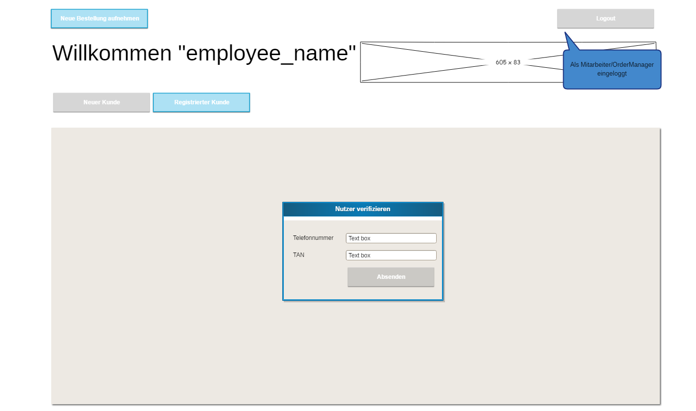
“Verifizierung der TAN von Bestellungen” 

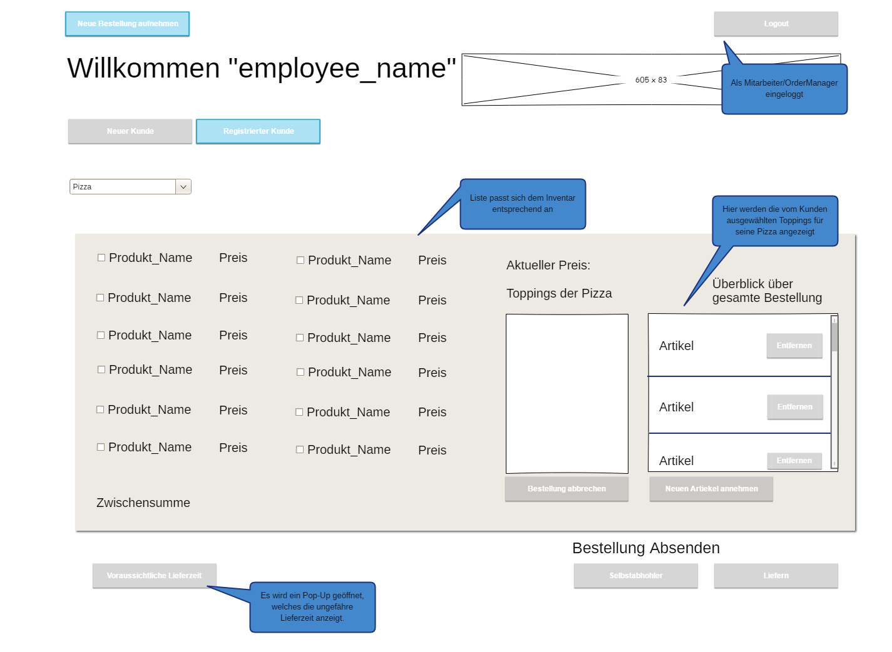
“Formular für die Erstellung der Bestellung”

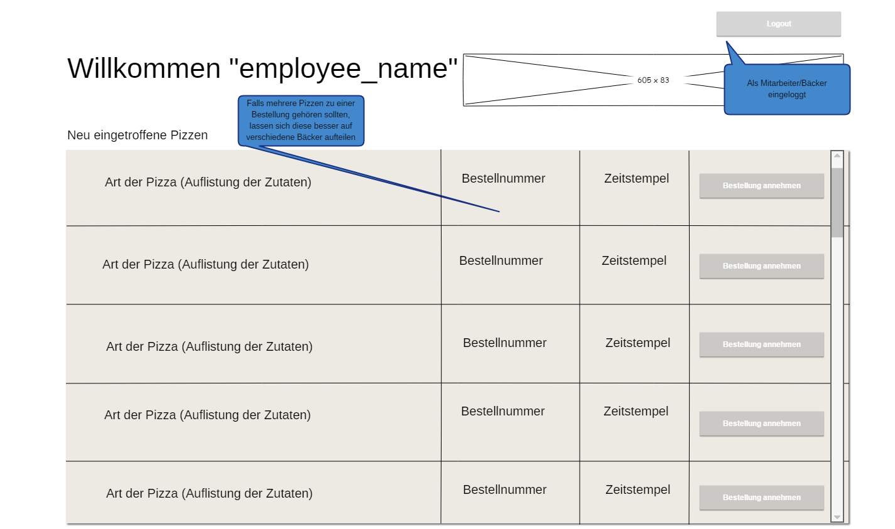
“Übersicht über zu backenden Pizzen für Pizzabäcker”

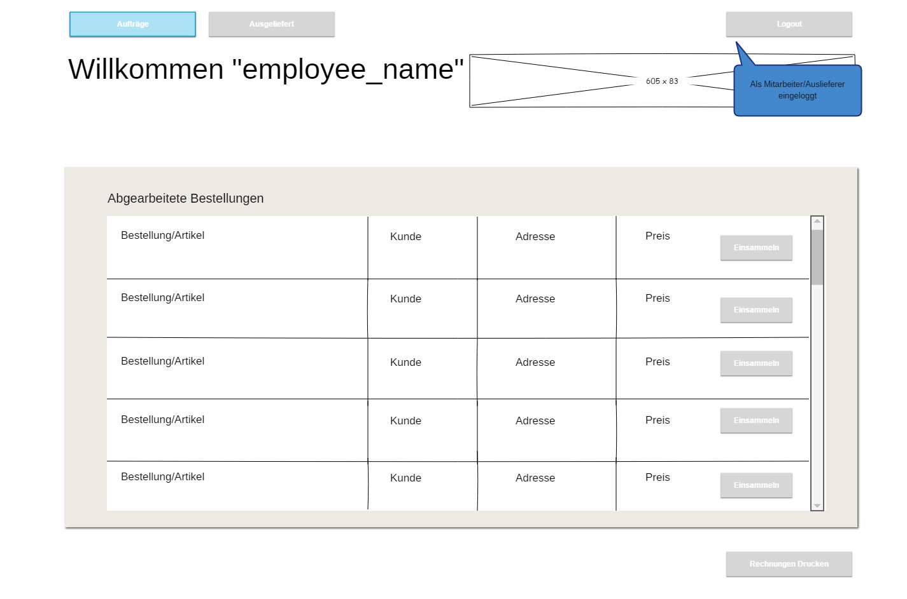
“Für Pizzaboten auslieferbare Bestellungen”

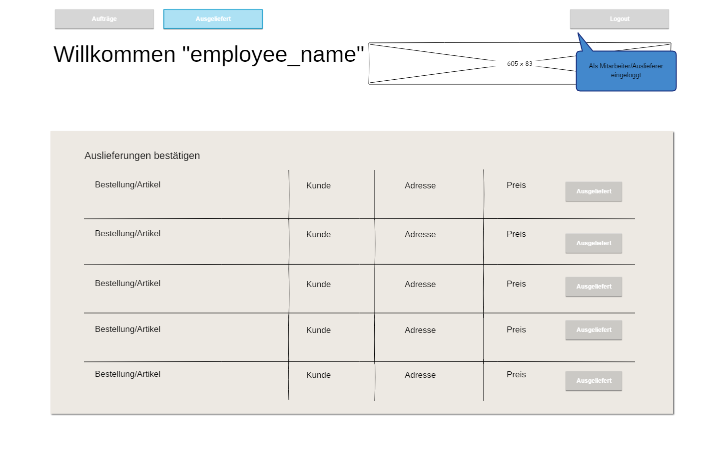
“Bestätigung einer erfolgreichen Auslieferung”

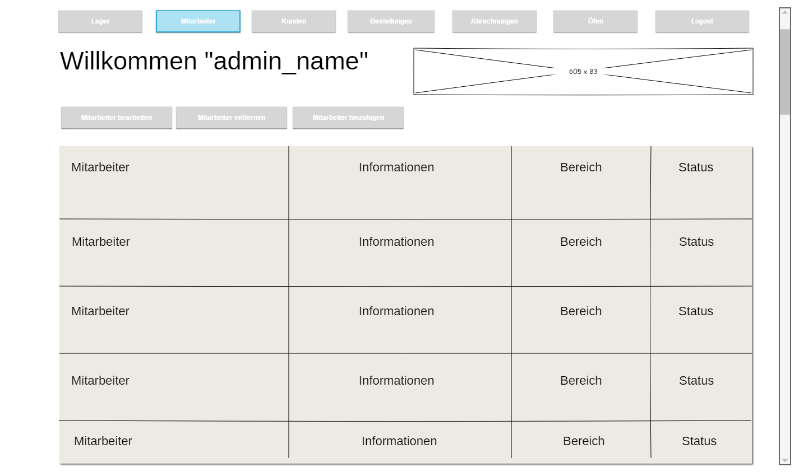
“Übersicht über Mitarbeiter für den Filialleiter”

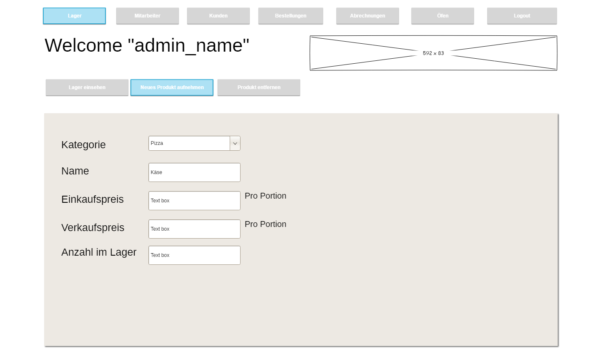
“Erstellung einer neuen Pizza durch den Filialleiter”

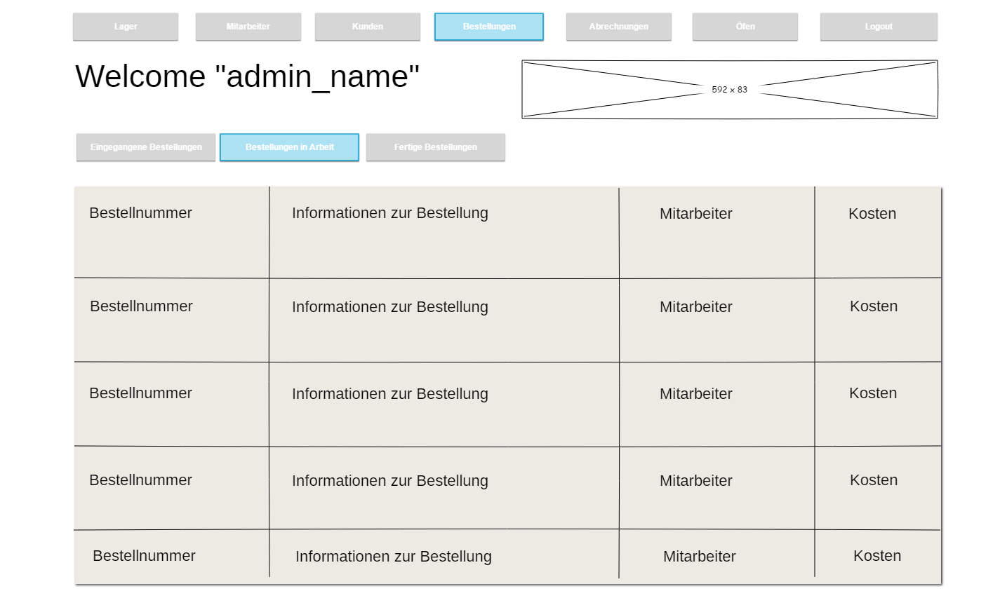
“Einsicht in die Bestellungen für den Filialleiter”

=== Bild der Dialoglandkarte
Beim Aufrufen der Hauptwebsite erhält der User einen Einblick über die bestellbaren Produkte. Er kann über Buttons zwischen den Kategorien: Pizza, Salate und Getränke wählen und erhält dann eine Auflistung der zur Verfügung stehenden Produkte aus der entsprechenden Kategorie.

In der oberen rechten Ecke gibt es einen Login-Button. Hier können sich Mitarbeiter über persönliche Benutzerdaten anmelden.
Durch den Login unterscheidet das System selbstständig, welche Inhalte der jeweilige Mitarbeiter einsehen und bearbeiten kann.

Der Admin wird auf eine Seite geleitet, welche ihm einen Überblick über seine Möglichkeiten gibt.
Er kann von hier zu spezifischen Punkten im System navigieren, wie zum Beispiel das Lager. Er kann es einsehen, Produkte neu hinzufügen, Produkte entfernen und Produkte auffüllen. Dafür öffnen sich durch Klicken auf den jeweiligen Button neue Dialogfenster mit den spezifischen Abfragen.
Zudem werden ihm auf dieser Seite der Überblick und die Bearbeitung von Mitarbeiter- und Kundendaten ermöglicht. Weiterhin erhält er Einblick in den laufenden Prozess.
Wird die Person als Bestellmanager eingeloggt, dann hat diese einen eingeschränkteren Zugriff. Der Bestellmanager besitzt die Möglichkeit, neue Kunden zu registrieren und neue Bestellungen aufzunehmen.
Wenn es sich um einen neuen Kunden handelt, dann wird ein neues Eingabefenster geöffnet und es werden die Daten des Kunden abgefragt. In diesem Fall muss der Kunde die Bestellung selbst abholen.
Sollte der Kunde bereits registriert sein, öffnet sich ein Verifizierungsfenster und der Bestellmanager gibt den Namen sowie die TAN des Kunden ein. Bei erfolgreichem Login wird die Bestellung durch Anklicken auf der linken Seite für z.B. eine neue Pizza eine neue Zutat ausgewählt und auf der rechten Seite zu einer Liste hinzugefügt. So kann der Mitarbeiter immer die gesamte Bestellung einsehen.
Es stehen dann Buttons zur Verfügung, um den Artikel aus der Bestellung zu löschen oder einen weiteren Artikel hinzuzufügen.
Am Ende wird unten auf der linken Seite die Zeit angegeben und auf der rechten Seite kann nach Eintragen der Bestelldetails zwischen Selbstabholer und Zuliefern ausgewählt werden.

Wird der User als Bäcker eingeloggt, so sieht er alle neu eingegangenen Bestellungen und kann dort sich eine Pizza auswählen.
Dann werden ihm groß alle Zutaten angezeigt.

Als Lieferer werden einem alle fertigen Bestellungen angezeigt. Durch einloggen meldet sich der Lieferer zurück und sieht alle für ihn relevanten Informationen zu den Bestellungen (insbesondere auch Adresse und Name, Telefonnummer des Kunden). Er kann die fertigen Bestellungen aufnehmen und dann die Rechnung drucken. So wird auch direkt eine neue TAN dem Kunden übergeben.

== Datenmodell

=== Überblick: Klassendiagramm

image::./models/design/Package papapizza.png[]
link:entwickler_doku.adoc#bausteinsicht[Hier zur aktuelle und ausführlichen Version des Klasssendiagramm]

=== Klassen und Enumerationen 
Dieser Abschnitt stellt eine Vereinigung von Glossar und der Beschreibung von Klassen/Enumerationen dar. Jede Klasse und Enumeration wird in Form eines Glossars textuell beschrieben. Zusätzlich werden eventuellen Konsistenz- und Formatierungsregeln aufgeführt.

[options="header"]
|===
|Klasse/Enumeration    |Beschreibung 
|Admin             |Registriert neue Mitarbeiter, nimmt neue Produkte ins Lager auf, erhöht die Anzahl der Produkte im Lager und ändert die Anzahl an Öfen
|Baker                           |Bäckt alle 5 Minuten eine Pizza, bestätigt dass die Pizza im Ofen ist.
|Bill            |In der Rechnung werden die neue TAN für den Kunden festgelegt und an den Kunden und die Filiale weitergeleitet.
|Customer         |Kunden, werden mit ihrer momentan gültigen TAN und den ausgeliehenen Besteck-Sets (sowie deren Ablaufdatum) im System gespeichert.
|Deliverer        |Sieht Auslieferungs-Aufträge ein, Bestätigt Auslieferungen
|Employee        |Repräsentiert die Mitarbeiter der Filiale. Können sich mit Benutzername und Passwort anmelden.
|Office            |Office repräsentiert die Filiale und verwaltet die Benutzer des Systems sowie die Bestellungen und Rechnungen.
|Order            |Die Bestellung beinhaltet eine beliebige Anzahl an Pizzen, Salaten, Getränken und Besteck-Sets.
|Ordermanager    |Nimmt die Bestellung des Kunden auf, registriert neue Kunden.
|Pizza            |Wird aus verschiedenen Belägen zusammengestellt.
|Product        |Repräsentiert die atomaren Produkte, die von Papa Pizza angeboten werden.
|Producttype        |Jedes Produkt ist entweder vom Typ Getränk, Salat, Belag oder Besteck-Set        
|Stock            |Enthält die vorhandenen Produkte im Lager.
|User            |Nutzer die im System gespeichert sind.
|Usertype        |Die User haben einen der Typen Kunde(Customer), Bäcker(Baker), Administrator(Admin), Bestellmanager(Ordermanager) oder Lieferant(Deliverer).
|===

== Akzeptanztestfälle

[[AT001]]
[cols="1h,3"]
|===
|ID                         |**<<AT001>>**
|Anwendungsfall             |**<<UC004>>**
|Vorbedingung(en)           |Das System hat registrierte Benutzer
|Event                      |Ein nicht eingeloggter Benutzer gibt im Login Bereich einen bereits im System registrierten Nutzernamen und Passwort ein.
|Erwartetes Ergebnis       a| *       Der Benutzer ist jetzt mit „Nutzername“ eingeloggt
*       Der Benutzer wird zur richtigen Ansicht weitergeleitet abhängig von seiner Rolle (Admin, Order Manager, Baker, Deliverer).
*       Der Benutzer hat jetzt Zugriff auf alle Funktionen die seine Rolle entsprechen
|===

[[AT002]]
[cols="1h,3"]
|===
|ID                         |**<<AT002>>**
|Anwendungsfall             |**<<UC004>>**
|Vorbedingung(en)           |Ein Benutzer ist eingeloggt und benutzt das System
|Event                      |Der eingeloggte Benutzer klickt auf dem Knopf „Logout“
|Erwartetes Ergebnis       a| *       Der Benutzer wird ausgeloggt
*       Er verliert alle Funktionalitäten die seiner Rolle entsprechen und hat nur noch Zugriff auf den Inhalt, der nicht eingeloggten Benutzer zu Verfügung steht.
|===

[[AT003]]
[cols="1h,3"]
|===
|ID                         |**<<AT003>>**
|Anwendungsfall             |**<<UC004>>**
|Vorbedingung(en)           |Das System hat registrierte Benutzer
|Event                      |Ein nicht eingeloggter Benutzer gibt im Login Bereich einen nicht im System vorhandenen Nutzernamen ein.
|Erwartetes Ergebnis       a|*       Der Benutzer wird nicht eingeloggt
*       Dem Benutzer wird eine Warnnachricht angezeigt: „Benutzername nicht vorhanden“
|===
[[AT004]]
[cols="1h,3"]
|===
|ID                         |**<<AT004>>**
|Anwendungsfall             |**<<UC004>>**
|Vorbedingung(en)           |-
|Event                      |Ein nicht eingeloggter Benutzer mindestens ein Formularfelder leer und klickt auf den Knopf „Login“.
|Erwartetes Ergebnis       a|*      Der Benutzer wird nicht eingeloggt
*       Dem Benutzer wird eine Warnnachricht angezeigt: „Dieses Feld muss ausgefüllt sein.“
|===

[[AT005]]
[cols="1h,3"]
|===
|ID                         |**<<AT005>>**
|Anwendungsfall             |**<<UC004>>**
|Vorbedingung(en)           |Das System hat registrierte Benutzer
|Event                      |Ein nicht eingeloggter Benutzer gibt im Login Bereich einen schon im System vorhandenen Nutzernamen ein, aber ein inkorrektes Passwort und klickt auf den Knopf „Login“.
|Erwartetes Ergebnis       a|*       Der Benutzer wird nicht eingeloggt
*       Dem Benutzer wird eine Warnnachricht angezeigt: „falsches Passwort“
|===

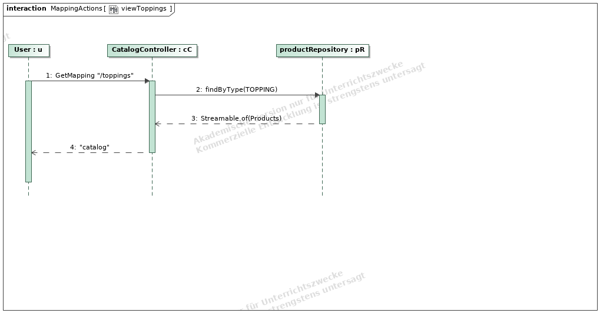

[[AT006]]
[cols="1h,3"]
|===
|ID                         |**<<AT006>>**
|Anwendungsfall             |**<<UC001>>**
|Vorbedingung(en)           |Ein nicht eingeloggter Kunde besucht die Website von Papa Pizza
|Event                      |Ein nicht eingeloggter Benutzer öffnet die Startseite von Papa Pizza oder klickt auf den “Pizza” Button im Menü.
|Erwartetes Ergebnis       a|*       Der Benutzer landet auf der Menüseite auf der die Pizzabeläge angezeigt werden.
|===

[[AT007]]
[cols="1h,3"]
|===
|ID                         |**<<AT007>>**
|Anwendungsfall             |**<<UC005>>**
|Vorbedingung(en)           |Ein Mitarbeiter der Rolle Admin ist eingeloggt und im Menü 'Mitarbeiter hinzufügen'.
|Event                      |Der Admin gibt einen Nutzernamen ein, welcher bereits im System registriert ist.
|Erwartetes Ergebnis       a|* der Mitarbeiter wird nicht hinzugefügt
* Eine Warnnachricht erscheint: “Benutzername schon vorhanden”
|===

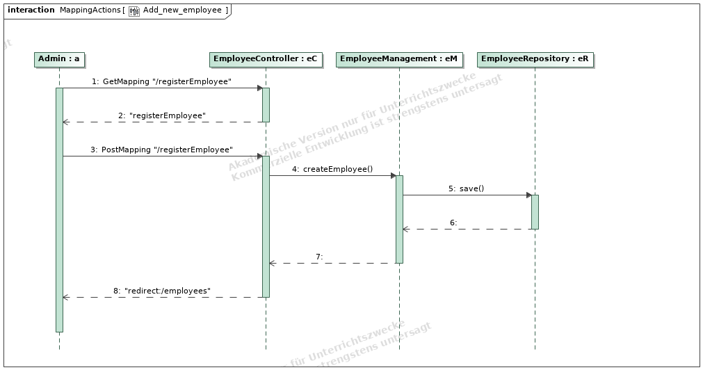

[[AT008]]
[cols="1h,3"]
|===
|ID                         |**<<AT008>>**
|Anwendungsfall             |**<<UC005>>**
|Vorbedingung(en)           |Ein Mitarbeiter der Rolle Admin ist eingeloggt und im Menü 'Mitarbeiter hinzufügen'.
|Event                      |Der Admin gibt einen Nutzernamen, welcher noch nicht im System registriert ist, sowie ein gültiges Passwort,eine Mitarbeiterrolle, Adresse und Telefonnummer, ein.
|Erwartetes Ergebnis       a|* Der Mitarbeiter wird neu hinzugefügt und im System hinterlegt.
|===

[[AT009]]
[cols="1h,3"]
|===
|ID                         |**<<AT009>>**
|Anwendungsfall             |**<<UC005>>**
|Vorbedingung(en)           |Ein Mitarbeiter der Rolle Admin ist eingeloggt und im Menü Mitarbeiter hinzufügen.
|Event                      |Der Admin gibt einen Nutzernamen ein, welcher noch nicht im System registriert ist, aber kein Passwort.
|Erwartetes Ergebnis       a|* der Mitarbeiter wird noch nicht hinzugefügt
* Eine Warnnachricht erscheint: “Dieses Feld muss ausgefüllt sein”
|===

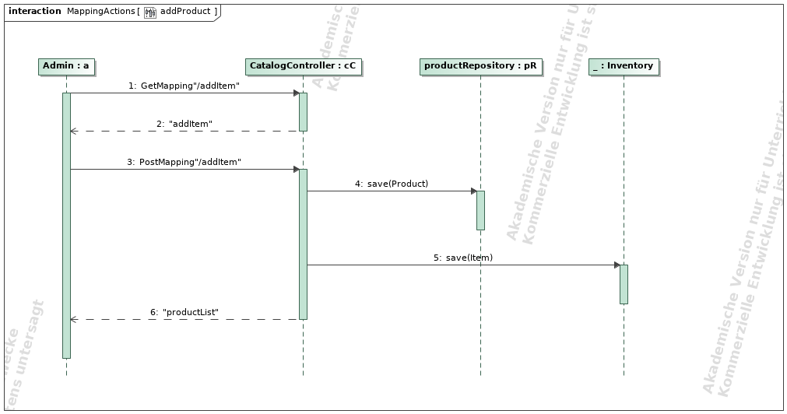

[[AT010]]
[cols="1h,3"]
|===
|ID                         |**<<AT010>>**
|Anwendungsfall             |**<<UC006>>**
|Vorbedingung(en)           |Ein Mitarbeiter der Rolle Admin ist eingeloggt und im Menü ‘neues Produkt aufnehmen’
|Event                      |Der Admin füllt die Felder ‘Name’, ‘Einkaufspreis’, ‘Verkaufspreis’ und ‘Anzahl im Lager’ korrekt aus und wählt eine Kategorie.
|Erwartetes Ergebnis       a|* Ein neues Produkt von der ausgewählten Kategorie wird mit den angegebenen Attributen angelegt.
|===

[[AT011]]
[cols="1h,3"]
|===
|ID                         |**<<AT011>>**
|Anwendungsfall             |**<<UC006>>**
|Vorbedingung(en)           |Ein Mitarbeiter der Rolle Admin ist eingeloggt und im Menü ‘neues Produkt aufnehmen’
|Event                      |Der Admin füllt mindestens eins der benötigten Felder nicht aus.
|Erwartetes Ergebnis       a|* Es wird kein neues Produkt angelegt
* eine Warnnachricht erscheint an den nicht ausgefüllten Feldern:”Dieses Feld muss ausgefüllt sein”
|===

[[AT012]]
[cols="1h,3"]
|===
|ID                         |**<<AT012>>**
|Anwendungsfall             |**<<UC006>>**
|Vorbedingung(en)           |Ein Mitarbeiter der Rolle Admin ist eingeloggt und im Menü ‘neues Produkt aufnehmen’
|Event                      |Der Admin füllt das Feld ‘Name’ mit einem Produktnamen, der schon im System registriert ist.
|Erwartetes Ergebnis       a|* Es wird kein neues Produkt angelegt
* eine Warnnachricht erscheint an den nicht ausgefüllten Feldern:”Produkt bereits enthalten”
|===

[[AT013]]
[cols="1h,3"]
|===
|ID                         |**<<AT013>>**
|Anwendungsfall             |**<<UC006>>**
|Vorbedingung(en)           |Ein Mitarbeiter der Rolle Admin ist eingeloggt und im Menü ‘Produkt entfernen’
|Event                      |Der Admin wählt mindestens ein Produkt zum entfernen aus und bestätigt die Eingabe.
|Erwartetes Ergebnis       a|* Das ausgewählte Produkt wird aus dem System entfernt.
|===

[[AT014]]
[cols="1h,3"]
|===
|ID                         |**<<AT014>>**
|Anwendungsfall             |**<<UC006>>**
|Vorbedingung(en)           |Ein Mitarbeiter der Rolle Admin ist eingeloggt und im Menü ‘Produkt bearbeiten’
|Event                      |Der Admin trägt in das ‘Anzahl’ Feld ein nicht numerisches Zeichen oder eine Zahl kleiner als Null ein.
|Erwartetes Ergebnis       a|* Die Anzahl wird nicht geändert
* eine Warnnachricht erscheint an den nicht ausgefüllten Feldern:”Bitte eine positive, ganze Zahl einfügen.”
|===

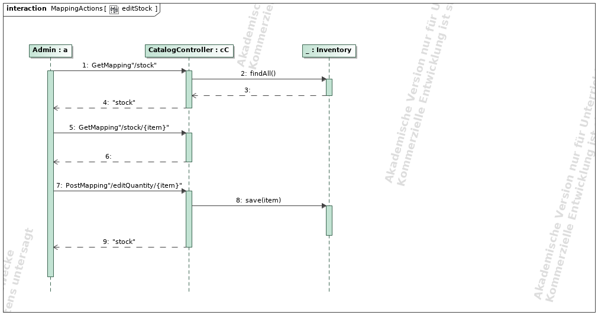

[[AT015]]
[cols="1h,3"]
|===
|ID                         |**<<AT015>>**
|Anwendungsfall             |**<<UC006>>**
|Vorbedingung(en)           |Ein Mitarbeiter der Rolle Admin ist eingeloggt und im Menü ‘Produkt bearbeiten’
|Event                      |Der Admin trägt in das ‘Anzahl’ Feld eine ganze, positive Zahl ein. 
|Erwartetes Ergebnis       a|* Die Anzahl wird auf die angegebene Anzahl geändert.
|===

[[AT016]]
[cols="1h,3"]
|===
|ID                         |**<<AT016>>**
|Anwendungsfall             |**<<UC007>>**
|Vorbedingung(en)           |Ein Mitarbeiter der Rolle Admin ist eingeloggt und im Menü ‘Öfen’
|Event                      |Der Admin trägt in das ‘Anzahl’ Feld ein nicht numerisches Zeichen oder eine Zahl kleiner als Null ein.
|Erwartetes Ergebnis       a|* Die Anzahl wird nicht geändert
* eine Warnnachricht erscheint an den nicht ausgefüllten Feldern:”Bitte eine positive, ganze Zahl einfügen.”
|===

[[AT017]]
[cols="1h,3"]
|===
|ID                         |**<<AT017>>**
|Anwendungsfall             |**<<UC007>>**
|Vorbedingung(en)           |Ein Mitarbeiter der Rolle Admin ist eingeloggt und im Menü ‘Öfen’
|Event                      |Der Admin trägt in das ‘Anzahl’ Feld eine positive, ganze Zahl ein.
|Erwartetes Ergebnis       a|* Die Anzahl der Öfen wird auf die angegebene Zahl geändert
|===

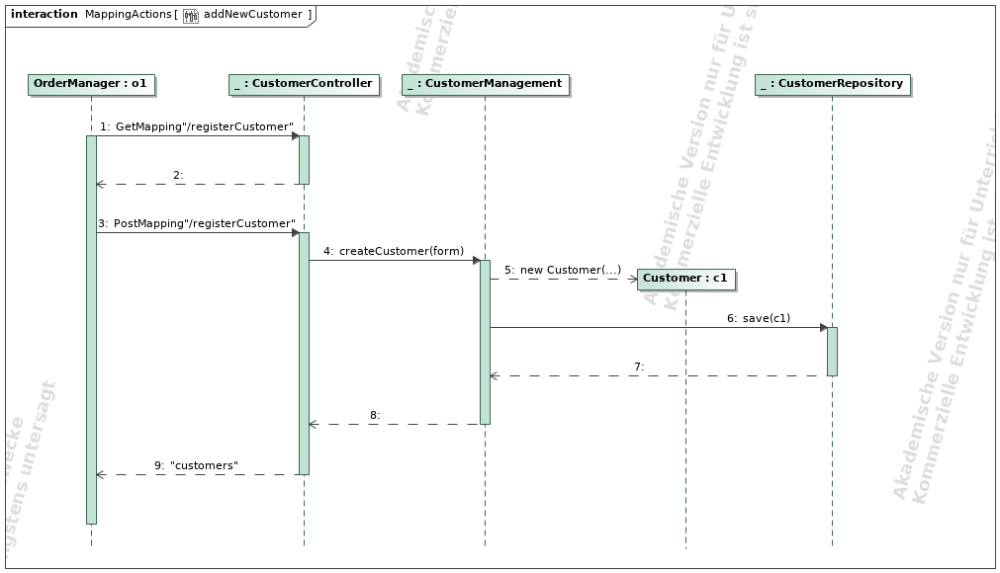

[[AT018]]
[cols="1h,3"]
|===
|ID                         |**<<AT018>>**
|Anwendungsfall             |**<<UC011>>**
|Vorbedingung(en)           |Ein eingeloggter Benutzer mit der Rolle Order Manager ist im Menü “neuer Kunde”|Event                      |Der Order Manager füllt alle Felder aus (Vorname, Name, Adresse und Telefonnummer) und bestätigt die Registrierung. Der Kunde ist im System noch nicht vorhanden.
|Erwartetes Ergebnis       a| *  Der Kunde wird erfolgreich im System gespeichert
*       eine neue TAN wird für den Kunde erzeugt und angezeigt
|===

[[AT019]]
[cols="1h,3"]
|===
|ID                         |**<<AT019>>**
|Anwendungsfall             |**<<UC011>>**
|Vorbedingung(en)           |Ein eingeloggter Benutzer mit der Rolle Order Manager ist im Menü “neuer Kunde”
|Event                      |DerOrder Manager füllt nicht alle Felder aus (Vorname, Name, Adresse und Telefonnummer) und bestätigt die Registrierung.
|Erwartetes Ergebnis       a| *  Der Kunde wird nicht erfolgreich im System gespeichert
       *     eine Warnnachricht erscheint an den nicht ausgefüllten Feldern:”Dieses Feld muss ausgefüllt sein”
|===

[[AT020]]
[cols="1h,3"]
|===
|ID                         |**<<AT020>>**
|Anwendungsfall             |**<<UC011>>**
|Vorbedingung(en)           |Ein eingeloggter Benutzer mit der Rolle Order Manager ist im Menü “neuer Kunde”und Kunden sind im System schon vorhanden.
|Event                      |Der Order Manager füllt alle Felder aus (Vorname, Name, Adresse und Telefonnummer) und bestätigt die Registrierung. Ein Kunde mit den exakt selben Daten ist schon im System vorhanden.
|Erwartetes Ergebnis       a| *  Der Kunde wird nicht im System gespeichert
       *     eine Warnnachricht erscheint an den nicht ausgefüllten Feldern:”Kunde schon vorhanden”
|===

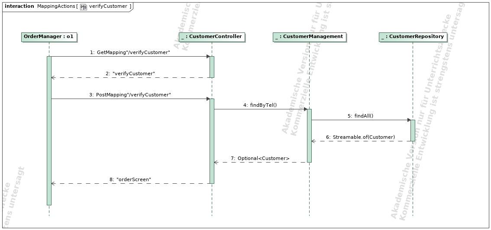
[[AT021]]
[cols="1h,3"]
|===
|ID                         |**<<AT021>>**
|Anwendungsfall             |**<<UC013>>**
|Vorbedingung(en)           |Ein eingeloggter Benutzer mit der Rolle Order Manager ist im Menü “Registrierter Kunde”, Kunden sind im System schon vorhanden.
|Event                      | Der Order Manager füllt  die Felder “Telefonnummer” und “TAN” aus und klickt auf dem Knopf “Bestätigen”. Der Kunde ist schon im System registriert.
|Erwartetes Ergebnis       a| * Die eingegebenen Daten werden mit denen im System verglichen -> Übereinstimmung
*  Der Mitarbeiter wird zum Bestellformular weitergeleitet.
|===

[[AT022]]
[cols="1h,3"]
|===
|ID                         |**<<AT022>>**
|Anwendungsfall             |**<<UC013>>**
|Vorbedingung(en)           |Ein eingeloggter Benutzer mit der Rolle Order Manager ist im Menü “Registrierter Kunde”
|Event                      |Der Order Manager füllt  die Felder “Telefonnummer” und “TAN” aus und klickt auf dem Knopf “Bestätigen”. Die Telefonnummer ist nicht im System vorhanden.
|Erwartetes Ergebnis       a| *  Der Mitarbeiter wird nicht zum Bestellformular weitergeleitet
 *     eine Warnnachricht erscheint:”Kunde nicht vorhanden”
|===

[[AT023]]
[cols="1h,3"]
|===
|ID                         |**<<AT023>>**
|Anwendungsfall             |**<<UC013>>**
|Vorbedingung(en)           |Ein eingeloggter Benutzer mit der Rolle Order Manager ist im Menü “Registrierter Kunde”
|Event                      |Der Order Manager füllt  die Felder “Telefonnummer” und “TAN” aus und klickt auf dem Knopf “Bestätigen”. Die Telefonnummer ist im System vorhanden aber die angegeben TAN stimmt nicht mit der im-System gespeicherten TAN.
|Erwartetes Ergebnis       a| *  Der Mitarbeiter wird nicht zum Bestellformular weitergeleitet
 *     eine Warnnachricht erscheint an den nicht ausgefüllten Feldern:”ungültige TAN”
|===

[[AT024]]
[cols="1h,3"]
|===
|ID                         |**<<AT024>>**
|Anwendungsfall             |**<<UC015>>**
|Vorbedingung(en)           |Ein Benutzer mit der Rolle Order Manager ist eingeloggt und hat den Kunden verifiziert.
|Event                      |Der Oder Manager wählt die gewünschte Ware aus der Liste aus.
|Erwartetes Ergebnis       a| * Das Produkt wird der Liste  “Überblick über gesamte Bestellung” hinzugefügt
|===

[[AT025]]
[cols="1h,3"]
|===
|ID                         |**<<AT025>>**
|Anwendungsfall             |**<<UC015>>**
|Vorbedingung(en)           |Ein eingeloggter Benutzer mit der Rolle Order Manager hat den Kunden verifiziert. Waren befinden sich schon in der Liste “Überblick über gesamte Bestellung”
|Event                      |Der Oder Manager klickt auf den Knopf “entfernen” in der Liste “Überblick über gesamte Bestellung”.
|Erwartetes Ergebnis       a| * Das Produkt wird aus der Liste  “Überblick über gesamte Bestellung” entfernt
|===

[[AT026]]
[cols="1h,3"]
|===
|ID                       |  **<<AT026>>**
|Anwendungsfall             |**<<UC012>>**
|Vorbedingung(en)           |Ein eingeloggter Benutzer mit der Rolle Order Manager hat den Kunden verifiziert. Waren befinden sich schon in der Liste “Überblick über gesamte Bestellung”
|Event                      |Der Order Manager klickt auf den Knopf “Selbstabholer” oder “Liefern”
|Erwartetes Ergebnis       a| * Die Bestellung wird im System weitergeleitet abhängig davon ob der Order Manager auf dem Knopf “Selbstabholer” oder “Liefern” gedrückt hat
* Der Order Manager landet zurück auf der Kunden Anmeldeoberfläche
|===

image::./models/analysis/Sequenzdiagramme/sd__Model__CancelOrder.png[]

[[AT027]]
[cols="1h,3"]
|===
|ID                         |**<<AT027>>**
|Anwendungsfall             |**<<UC012>>**
|Vorbedingung(en)           |Ein eingeloggter Benutzer mit der Rolle Order Manager hat den Kunden verifiziert.
|Event                      |Der Order Manager klickt auf den Knopf “Bestellung abbrechen”
|Erwartetes Ergebnis       a| * Die Bestellung wird nicht weitergeleitet
* Der Order Manager landet zurück auf der Kunden Anmeldeoberfläche
|===

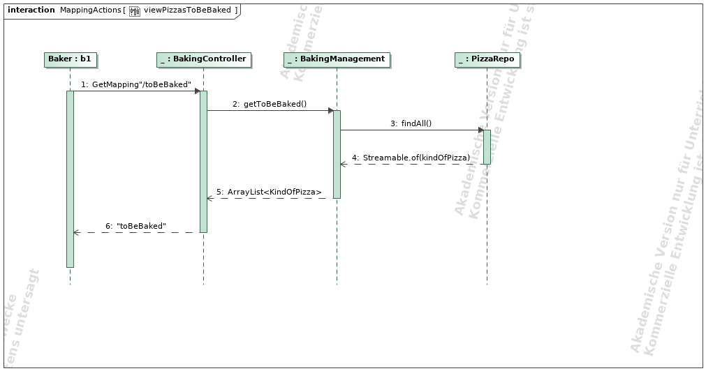

[[AT028]]
[cols="1h,3"]
|===
|ID                         |**<<AT028>>**
|Anwendungsfall       |**<<UC016>>**
|Vorbedingung(en)           |Mitarbeiter der Rolle Baker existieren im System.
|Event                      |Ein Mitarbeiter der Rolle Baker loggt sich ein.
|Erwartetes Ergebnis       a|* Der Mitarbeiter wird zu der Seite weitergeleitet, auf der alle noch nicht fertigen Pizzen aufgelistet sind.
|===

[[AT029]]

[cols="1h,3"]
|===
|ID                         |**<<AT029>>**
|Anwendungsfall       |**<<UC017>>**  
|Vorbedingung(en)           |Mitarbeiter der  Baker ist eingeloggt.
|Event                      |Ein Mitarbeiter der Rolle Baker drückt auf den Button “im Ofen” in der Liste der noch nicht fertigen Pizzen.
|Erwartetes Ergebnis       a|* Der Status der jeweiligen Pizza wird auf “im Ofen” gesetzt, und nach einem Timer von 5 Minuten automatisch in die Liste der zustellbaren Pizzen gelegt.
|===

image::./models/analysis/Sequenzdiagramme/sd__ViewPizzasToBeDelivered__ViewPizzasToBeDelivered.png[]

[[AT030]]
[cols="1h,3"]
|===
|ID             |**<<AT030>>**
|Anwendungsfall     |**<<UC018>>**
|Vorbedingung(en)    |Benutzer mit der Rolle Deliverer existieren
|Event            |Ein Mitarbeiter mit der Rolle Deliverer loggt sich ein
|Erwartetes Ergebnis    a|* Der Deliverer wird auf eine Seite “Aufträge” geleitet, auf der eine Liste der noch zuzustellenden Pizzen mit den Adressen der Kunden angezeigt wird.
|===

[[AT031]]
[cols="1h,3"]
|===
|ID             |**<<AT031>>**
|Anwendungsfall     |**<<UC019>>**
|Vorbedingung(en)    |Ein Benutzer mit der Rolle Deliverer ist eingeloggt und auf dem Menüpunkt “Aufträge”
|Event            |Der Deliverer drückt auf den Button “einsammeln”    
|Erwartetes Ergebnis a|* Die ausgewählte Bestellung wird aus der Liste “Einsammeln” auf die Liste “Ausgeliefert” geschoben.
|===

[[AT032]]
[cols="1h,3"]
|===
|ID             |**<<AT032>>**
|Anwendungsfall     |**<<UC020>>**
|Vorbedingung(en)    |Ein Benutzer mit der Rolle Deliverer ist eingeloggt und auf dem Menüpunkt “Eingesammelt”
|Event            |Der Deliverer drückt auf den Button “Ausgeliefert”    
|Erwartetes Ergebnis a|* Die ausgewählte Bestellung wird aus der Liste “Ausgeliefert” entfernt.
|===

== Glossar
Sämtliche Begriffe, die innerhalb des Projektes verwendet werden und deren gemeinsames Verständnis aller beteiligten Stakeholder essentiell ist, sollten hier aufgeführt werden.
Insbesondere Begriffe der zu implementierenden Domäne wurden bereits beschrieben, jedoch gibt es meist mehr Begriffe, die einer Beschreibung bedürfen. +
Beispiel: Was bedeutet "Kunde"? Ein Nutzer des Systems? Der Kunde des Projektes (Auftraggeber)?

[options=header, cols="1h,4"]
|===
|Begriff | Definition
|Developer |      Die Auftragnehmer, sie sind verantwortlich für das erstellen des Programms
|Kunde | diese Person kauft bei Papa Pizza ein
|Auftraggeber | Die Person, welche dem Developer den Auftrag erteilt
|User| Der User stellt eine Person dar, welche grundlegende Attribute besitzt. Andere Personen leiten sich vom User ab.
|Mitarbeiter | Diese Person wird vom Auftraggeber angestellt
|OrderManager | Diese Person, als Angestellter, nimmt die Bestellungen entgegen und kann  neue Kunden registrieren 
|Baker| Diese Person, als Angestellter, ist für das zusammenstellen und backen der Pizzen zuständig
|Deliverer| Diese Person, als Angestellter, ist für die Auslieferung der Bestellungen verantwortlich
|Admin| Diese Person ist Systemvorgesetzter, damit für die Bestellungen der Grundprodukte, Verwaltung der Mitarbeiter, des Lagers, sowie der Grundausstattung der Filiale verantwortlich
|Office| Das Büro/Office ist die Verwaltung der Filiale
|Bill| die Rechnung enthält alle Daten der Bestellung, sowie eine neue TAN. Sie wird dem Kunden übergeben und zur statistischen Erhebung von Daten intern gespeichert
|TAN| Die TAN ist eine benutzerspezifische Nummer, welche zum Login der Kunden benötigt wird
|Order| Die Order ist für die interne Verarbeitung der Bestellung notwendig, aus ihr wird die Rechnung generiert.
|Product | Ein Produkt stellt eine Grundzutat dar. Sie kann Teil einer Pizza, aber auch eigenständiges Teil einer Bestellung sein.
|Stock/Lager | Dies stellt die Speicherung von Vorräten dar. Dort befinden sich alle Produkte, welche zur verfügung stehen und vom Kunden bestellt werden können.
|Rolle | Die Rolle / der Typ den ein User im System annimmt. Bestimmt die Zugriffsrechte auf bestimmte Abschnitte der Anwendung.
|===

== Überraschender Kundenwunsch
Der Admin hat die Möglichkeit Rabattcoupons anzulegen. Diese besitzen einen Namen (den Code) und einen Beschreibungstext.
Wird dem Bestellungsmanager am Ende einer Bestellung durch den Kunden ein CouponCode angegeben, so kann dieser in ein dafür vorgesehenes Feld eingetragen werden und es wird ein Rabatt von +10 % auf die Bestellung gegeben.

== Offene Punkte
Offene Punkte werden entweder direkt in der Spezifikation notiert. Wenn das Pflichtenheft zum finalen Review vorgelegt wird, sollte es keine offenen Punkte mehr geben.

